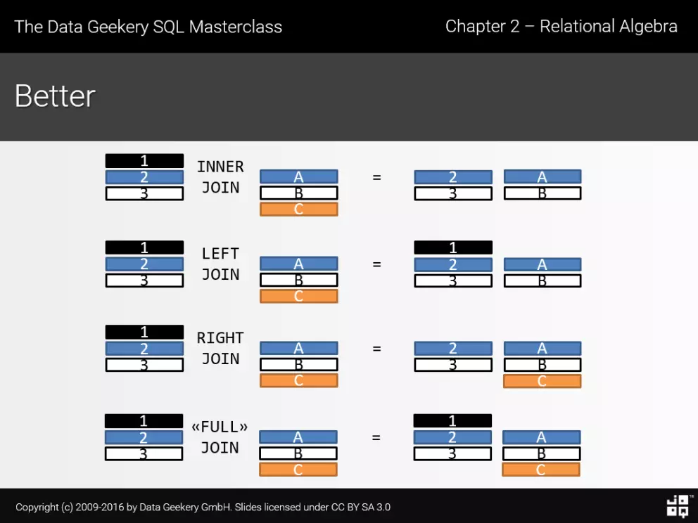
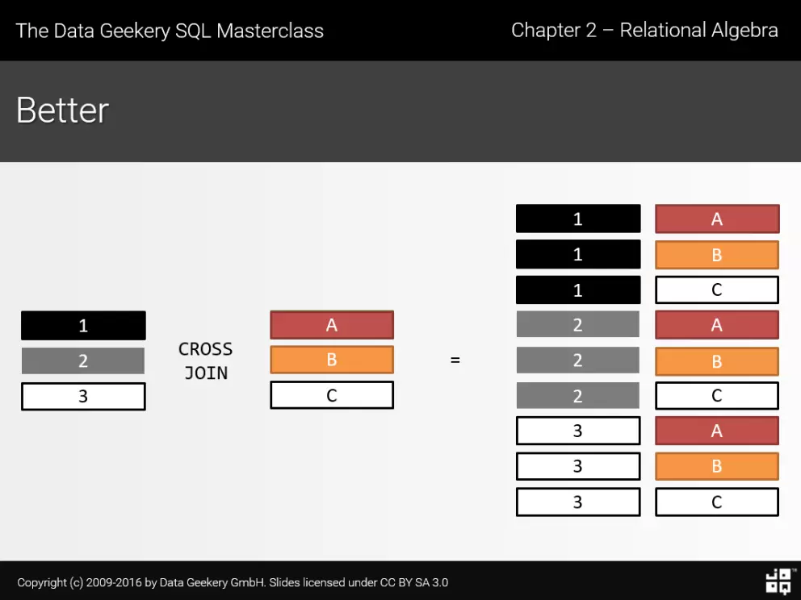

[TOC]

# [数据库、schema、catalog](https://blog.csdn.net/zuiaituantuan/article/details/5974839) 

数据库：指的是说MySQL（或者说Oracle等）

schema： 指的是说当偶create database caiceclb时，caiceclb就是一个schema

catalog： 指的是所有的database目录，就像上图显示的那样，将MySQL原来的（mysql,infomation_schema）及后来新建的的database的集合。

从实现的角度来看，各种数据库系统对Catalog和Schema的支持和实现方式千差万别，针对具体问题需要参考具体的产品说明书，比较简单而常用的实现方式是使用数据库名作为Catalog名，使用用户名作为Schema名

# [范式](https://www.zhihu.com/question/24696366)

## 数据库基本概念

关系数据库就是用二维表来保存数据。

**码：**表中可以唯一确定一个元组的某个属性（或者属性组），如果这样的码有不止一个，那么大家都叫**候选码**，我们从候选码中挑一个出来做老大，它就叫主码。

**全码 ：**如果一个码包含了所有的属性，这个码就是全码。

**主属性：**一个属性只要在任何一个候选码中出现过，这个属性就是主属性。

**非主属性：**与上面相反，没有在任何候选码中出现过，这个属性就是非主属性。

一个数据表只能有一个主键，且主键的取值不能缺失，即不能为空值（Null）。

primary key和unique key有很多相似之处。但还是有以下区别：

1. 作为primary key的域／域组不能为Null。而unique key可以。
2. 在一个表中只能有一个primary key，而多个unique key可以同时存在。
3. 更大的区别在逻辑设计上。primary key一般在逻辑设计中用作记录标识，这也是设置primary key的本来用意。而unique key只是为了保证域／域组的唯一性。

**外键** ：其实在关系数据库中，每个数据表都是由关系来连系彼此的关系，父数据表（Parent Entity）的[主键](https://zh.wikipedia.org/wiki/%E4%B8%BB%E9%94%AE)（primary key）会放在另一个数据表，当做属性以创建彼此的关系，而这个属性就是外键。

## 范式

构造数据库必须遵循一定的规则。在关系数据库中，这种规则就是范式。

关系规范化的目的是解决关系模式中存在的数据冗余、插入和删除异常、更新繁琐等问题。其基本思想是消除数据依赖中的不合适部分，使各关系模式达到某种程度的分离，<u>使一个关系描述一个概念、一个实体或实体间的一种联系。</u>因此，规范化的实质是**概念的单一化**。

##1NF

**第一范式（1NF）：符合1NF的关系中的每个属性都不可再分。** 

1. 实际上，**1NF是所有关系型数据库的最基本要求**，
2. 只要在RDBMS中已经存在的数据表，一定是符合1NF的。
3. 但是仅仅符合1NF的设计，仍然会存在数据冗余过大，插入异常，删除异常，修改异常的问题

##2NF

**第二范式：2NF在1NF的基础之上，消除了非主属性对于码的部分函数依赖**。

也就是非主属性不能由码的一部分来确定

##3NF

**第三范式（3NF）** **3NF在2NF的基础之上，消除了非主属性对于码的传递函数依赖**。

非主属性不能由其他的非主属性确定，至此，**非主属性被且仅被码来确定**

符合3NF要求的数据库设计，**基本**上解决了数据冗余过大，插入异常，修改异常，删除异常的问题。当然，在实际中，往往为了性能上或者应对扩展的需要，经常 做到2NF或者1NF

##改进的3NF：BCNF

虽然满足3NF，即不存在非主属性对主属性的部分依赖 和 非主属性对码的传递依赖，但可能存在**主属性决定主属性的情况**。这是不满足的BCNF的。

在这种情况下，会存在**插入异常，修改异常与删除异常**的问题，仍然不是 ”好“ 的设计。

例如如下图所示的关系模式 仓库（仓库名，管理员，物品名，数量） 属于哪一级范式？

答：已知函数依赖集：仓库名 → 管理员，管理员 → 仓库名，（仓库名，物品名）→ 数量
码：（管理员，物品名），（仓库名，物品名）
主属性：仓库名、管理员、物品名
非主属性：数量

因为（仓库名，物品名）--> 数量和（管理员，物品名）→ 数量，所以存在非主属性对码的部分函数依赖，此关系属于1NF

##总结：

各种范式呈递次规范，越高的范式数据库冗余越小。

范式的包含关系。一个数据库设计如果符合第二范式，一定也符合第一范式。如果符合第三范式，一定也符合第二范式…

范式越高，数据的冗余度越小。其实没有冗余的数据库设计是可以做到的。但是，没**有冗余的数据库未必是最好的数据库**，有时为了提高运行效率，就必须降低范式标准，适当保留冗余数据。

降低范式就是增加字段，允许冗余。

# Optimize Table

[实例说明optimize table在优化mysql时很重要](http://blog.51yip.com/mysql/1222.html)

使用OPTIMIZE TABLE来重新利用未使用的空间，并整理数据文件的碎片。

在多数的设置中，您根本不需要运行OPTIMIZE TABLE。即使您对可变长度的行进行了大量的更新，您也不需要经常运行，每周一次或每月一次即可，只对特定的表运行。

OPTIMIZE TABLE只对MyISAM, BDB和InnoDB表起作用。

注意，在OPTIMIZE TABLE运行过程中，MySQL会锁定表。

# SQL

## [Join](https://juejin.im/entry/59474d0261ff4b006cf7a4cb)

如果我们想在两个或以上的表获取其中从一个表中的行与另一个表中的<u>行匹配</u>的数据，这时我们应该考虑使用Join

1. Inner Join & Outer Join

   SELECT * FROM table_1 t1 INNER JOIN table_2 t2 ON t1.id = t2.id;

   

2. Cross Join

   

# InnoDB

## 索引

随机事件--》顺序事件

内存访问速度是磁盘的十万倍

一次磁盘IO，读取一页（4K or 8K）的数据；

### B+ 树性质

1. m 叉树，为了减少磁盘IO次数

2. 叶子节点存储数据，使用双向链表进行连接，方便区间查找；非叶子节点存放索引

3. 一般情况下，<u>根节点在内存，非根节点在磁盘</u>

4. B+树每个节点的大小等于一个页的大小

   IO次数 = 树高度

   m = 磁盘块大小 / 数据项大小 

   N ： 数据量 h = log(m+1) N，

   因此，m up, h down，所以每个数据项，即索引字段要尽量小

5. 当b+树的数据项是复合的数据结构，比如(name,age,sex)的时候，b+数是按照从左到右的顺序来建立搜索树的（联合索引）

### 建索引的几大原则

1. 最左前缀匹配原则，mysql会一直向右匹配直到遇到范围查询(>、<、between、like)就停止匹配
2. 尽量选择区分度高的列作为索引 Cardinality --》 hash 数据倾斜
3. 尽量的扩展索引，不要新建索引

## 锁

InnoDB行锁是通过索引上的索引项来实现的。InnoDB这种行锁实现特点意味着：只有通过索引条件检索数据，InnoDB才使用行级锁，否则，InnoDB将使用表锁！

很显然，在使用范围条件检索并锁定记录时，InnoDB这种加锁机制会阻塞符合条件范围内键值的并发插入，这往往会造成严重的锁等待。因此，在实际开发中，尤其是并发插入比较多的应用，我们要尽量优化业务逻辑，尽量使用相等条件来访问更新数据，<u>避免使用范围条件</u>。

行锁防止别的事务修改或删除，GAP锁防止别的事务新增，行锁和GAP锁结合形成的的Next-Key锁共同解决了RR级别在写数据时的幻读问题。

### [死锁 VS 阻塞](https://blog.csdn.net/Mind_programmonkey/article/details/80446290)

阻塞：

由于**资源不足**而引起的**排队等待**现象。

死锁:

1）互斥条件：指进程对所分配到的资源进行排它性使用，即在一段时间内某资源只由一个进程占用。如果此时还有其它进程请求资源，则请求者只能等待，直至占有资源的进程用毕释放。

2）不剥夺条件：指进程已获得的资源，在未使用完之前，不能被剥夺，只能在使用完时由自己释放。

3）请求和保持条件：指进程已经保持至少一个资源，但又提出了新的资源请求，而该资源已被其它进程占有，此时请求进程阻塞，但又对自己已获得的其它资源保持不放。

4）环路等待条件：指在发生死锁时，必然存在一个进程——资源的环形链，即进程集合{P0，P1，P2，···，Pn}中的P0正在等待一个P1占用的资源；P1正在等待P2占用的资源，……，Pn正在等待已被P0占用的资源。

tips: 

1. 阻塞：至少是有一个线程/进程在占有了所有需要的资源，正在运行，其他线程/进程**排队等待**
2. 死锁：所以进程/线程都不能运行，**互相等待**

### 锁问题：

#### 不可重复读和幻读的区别

很多人容易搞混不可重复读和幻读，确实这两者有些相似。都是在一个事务的过程中，两次读取的数据不同。

<u>但不可重复读重点在于update和delete，而幻读的重点在于insert。</u>读到的数据有别的事务中新增的数据

不可重复读和幻读最大的区别，就在于如何通过锁机制来解决他们产生的问题。

**行锁**防止别的事务修改或删除，GAP锁防止别的事务新增，行锁和GAP锁结合形成的的**Next-Key锁**共同解决了RR级别在写数据时的幻读问题。

## 事务

事务（Transaction）是并发控制的基本单位。

