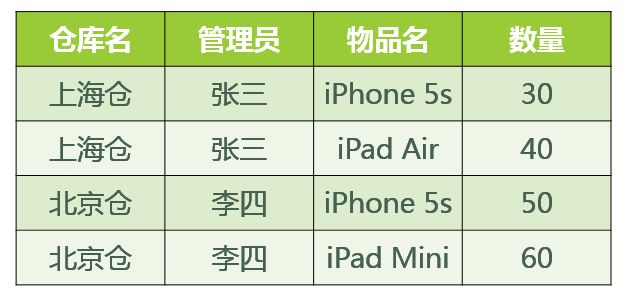

[TOC]

# [数据库、schema、catalog](https://blog.csdn.net/zuiaituantuan/article/details/5974839) 

数据库：指的是说MySQL（或者说Oracle等）

schema： 指的是说当偶create database caiceclb时，caiceclb就是一个schema

catalog： 指的是所有的database目录，就像上图显示的那样，将MySQL原来的（mysql,infomation_schema）及后来新建的的database的集合。

从实现的角度来看，各种数据库系统对Catalog和Schema的支持和实现方式千差万别，针对具体问题需要参考具体的产品说明书，比较简单而常用的实现方式是使用数据库名作为Catalog名，使用用户名作为Schema名

# [范式](https://www.zhihu.com/question/24696366)

## 数据库基本概念

关系数据库就是用二维表来保存数据。

**码：**表中可以唯一确定一个元组的某个属性（或者属性组），如果这样的码有不止一个，那么大家都叫   候选码，我们从候选码中挑一个出来做老大，它就叫主码。

**全码 ：**如果一个码包含了所有的属性，这个码就是全码。

**主属性：**一个属性只要在任何一个候选码中出现过，这个属性就是主属性。

**非主属性：**与上面相反，没有在任何候选码中出现过，这个属性就是非主属性。

##1NF

**第一范式（1NF）：符合1NF的关系中的每个属性都不可再分。** 

1. 实际上，**1NF是所有关系型数据库的最基本要求**，
2. 只要在RDBMS中已经存在的数据表，一定是符合1NF的。
3. 但是仅仅符合1NF的设计，仍然会存在数据冗余过大，插入异常，删除异常，修改异常的问题

##2NF

**第二范式：2NF在1NF的基础之上，消除了非主属性对于码的部分函数依赖**。

也就是非主属性不能由码的一部分来确定

##3NF

**第三范式（3NF）** **3NF在2NF的基础之上，消除了非主属性对于码的传递函数依赖**。

非主属性不能由其他的非主属性确定

符合3NF要求的数据库设计，**基本**上解决了数据冗余过大，插入异常，修改异常，删除异常的问题。当然，在实际中，往往为了性能上或者应对扩展的需要，经常 做到2NF或者1NF

##BCNF

**但是在某些特殊情况下**，即使关系模式符合 3NF 的要求，仍然存在着插入异常，修改异常与删除异常的问题，仍然不是 ”好“ 的设计。

例如如下图所示的关系模式 仓库（仓库名，管理员，物品名，数量） 属于哪一级范式？

答：已知函数依赖集：仓库名 → 管理员，管理员 → 仓库名，（仓库名，物品名）→ 数量
码：（管理员，物品名），（仓库名，物品名）
主属性：仓库名、管理员、物品名
非主属性：数量
∵ 不存在非主属性对码的部分函数依赖和传递函数依赖。∴ 此关系模式属于3NF。

好，既然此关系模式已经属于了 3NF，那么这个关系模式是否存在问题呢？我们来看以下几种操作：

1. 先新增加一个仓库，但尚未存放任何物品，是否可以为该仓库指派管理员？——不可以，因为物品名也是主属性，根据实体完整性的要求，主属性不能为空。
2. 某仓库被清空后，需要删除所有与这个仓库相关的物品存放记录，会带来什么问题？——仓库本身与管理员的信息也被随之删除了。
3. 如果某仓库更换了管理员，会带来什么问题？——这个仓库有几条物品存放记录，就要修改多少次管理员信息。

造成此问题的原因：存在着**主属性**对于码的部分函数依赖与传递函数依赖。（在此例中就是存在主属性【仓库名】对于码【（管理员，物品名）】的部分函数依赖。

解决办法就是要在 3NF 的基础上**消除主属性对于码的部分与传递函数依赖。**

仓库（仓库名，管理员）
库存（仓库名，物品名，数量）

这样，之前的插入异常，修改异常与删除异常的问题就被解决了。

以上就是关于 BCNF 的解释。

##总结：

各种范式呈递次规范，越高的范式数据库冗余越小。

范式的包含关系。一个数据库设计如果符合第二范式，一定也符合第一范式。如果符合第三范式，一定也符合第二范式…

范式越高，数据的冗余度越小。其实没有冗余的数据库设计是可以做到的。但是，没**有冗余的数据库未必是最好的数据库**，有时为了提高运行效率，就必须降低范式标准，适当保留冗余数据。

降低范式就是增加字段，允许冗余。