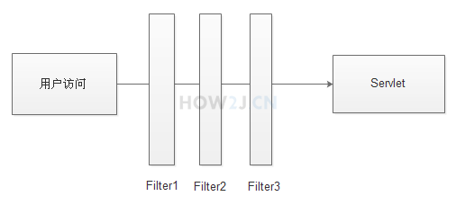

## Hello Filter

###Filter概念

Filter就像一个一个哨卡，用户的请求需要经过Filter
并且可以有多个过滤器



### 编写

可以看出FirstFilter类实现Filter接口，需要实现destroy，doFilter 和 init 三个函数

```java
public class FirstFilter implements Filter {
  @Override
  public void destroy() {
    System.out.println("FirstFilter destroy()");
  }

  @Override
  public void doFilter(ServletRequest req, ServletResponse res, FilterChain chain)
    throws IOException, ServletException {
    System.out.println("FirstFilter doFilter()");
    HttpServletRequest request = (HttpServletRequest) req;
    HttpServletResponse response = (HttpServletResponse) res;

    // 获取来路用户的ip地址
    String ip = request.getRemoteAddr();
    // 获取用户访问的页面地址
    String url = request.getRequestURL().toString();

    SimpleDateFormat sdf = new SimpleDateFormat("yyyy-MM-dd HH:mm:ss");
    Date d = new Date();
    String date = sdf.format(d);

    System.out.printf("%s %s 访问了 %s%n", date, ip, url);
    // 过滤器放行，表示继续运行下一个过滤器，或者最终访问的某个servlet,jsp,html等等
    chain.doFilter(request, response);
  }

  @Override
  public void init(FilterConfig arg0) throws ServletException {
    System.out.println("FirstFilter init()");
  }

}
```

### 配置web.xml

```xml
<filter>
  <filter-name>FirstFilter</filter-name>
  <filter-class>filter.FirstFilter</filter-class>
</filter>

<filter-mapping>
  <filter-name>FirstFilter</filter-name>
  <!--表示所有的访问都会过滤-->
  <url-pattern>/*</url-pattern>
</filter-mapping>
```

与Servlet需要配置自启动才会随着tomcat的启动而执行init()方法不一样。

<u>Filter一定会随着tomcat的启动**自启动**。</u>

### Filter启动失败

Filter是web应用非常重要的一个环节，如果**Filter启动失败**，或**者本身有编译错误**，不仅这个Filter不能使用，整个web应用会启动失败，导致用户无法访问页面

在启动tomcat过程中，也会看到这样的字样： 

`One or more Filters failed to start. Full details will be found in the appropriate container log file`

 `Context [] startup failed due to previous errors `

这常常用于提示Filter启动失败了

## 中文处理

### 使用Servlet处理的局限性

在通过*Servlet获取中文参数* 的章节中知道，可以通过

`request.setCharacterEncoding("UTF-8");`

正确获取UTF-8编码的中文，但是如果有很多servlet都需要获取中文，那么就必须在每个Servlet中增加这段代码。

有一个简便的办法，那就是通过Filter过滤器进行中文处理 ，这个Filter是所有请求的入口`<url-pattern>/*</url-pattern>`，那么**所有的Servlet都不需要单独处理**了。


## 登陆验证

### 在Servlet中进行登陆验证的局限性

在用户是否登陆的验证中，我们可以通过在HeroListServlet中增加对session的判断代码来做到登陆验证。

但是按照这样的做法，所有的Servlet都要加上一样的代码，就会显得比较累赘。

与通过Filter处理中文问题一样，也可以通过Filter一次性解决所有的登陆验证问题

##总结

中文处理和登录验证是filter的两种应用，都利用了filter的过滤所有网页请求的特点。

*写一个Filter()，省很多事*

