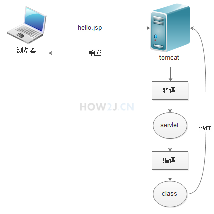
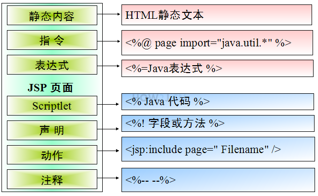
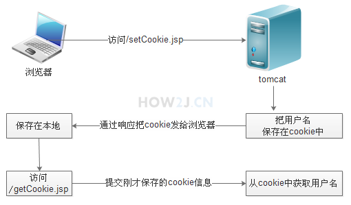
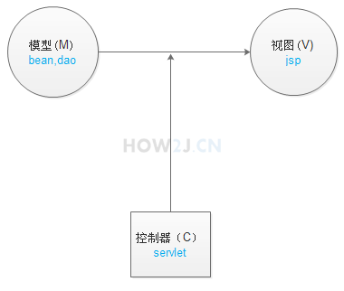
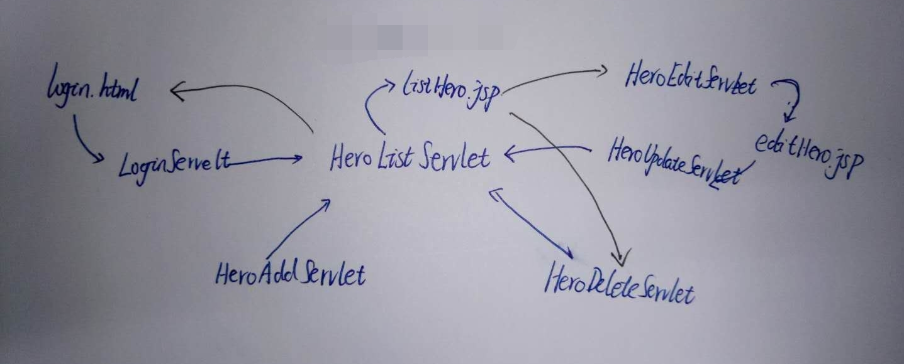

## 执行过程

为什么JSP可以在html中运行java代码？ 这是因为JSP被转译成了 Servlet

1. 把 hello.jsp转译为hello_jsp.java
2. hello_jsp.java 位于
  C:\Users\Administrator\.IntelliJIdea2017.2\system\tomcat\Unnamed_JSP\work\Catalina\localhost\ROOT\org\apache\jsp
3. hello_jsp.java是一个servlet
4. 把hello_jsp.java 编译为hello_jsp.class
5. 执行hello_jsp，生成html
6. 通过http协议把html 响应返回给浏览器



## 页面元素



## include

### 指令include

通过指令

`<%@include file="footer.jsp" %>` 

在hello.jsp中包含该页面

### 动作include

通过动作

`<jsp:include page="footer.jsp" />` 

在hello.jsp中包含该页面

### 两者区别？

## Cooike

Cookie是一种浏览器和服务器交互数据的方式。

Cookie是由服务器端创建，但是不会保存在服务器。

创建好之后，发送给浏览器。浏览器保存在用户本地。

下一次访问网站的时候，如果Cooike没有被销毁的话，就会把该Cookie发送给服务器。

###设置Cooike

```java
// 创建了一个cookie,名字是"name" 值是"Gareen"
Cookie c = new Cookie("name", "Gareen");
// 表示这个cookie可以保留30s，如果是0，表示浏览器一关闭就销毁
c.setMaxAge(30);
// Path表示服务器的主机名，只有浏览器通过这个主机名访问服务器的时候，才会提交这个cookie到服务端
c.setPath("127.0.0.1");
// 通过response把这个cookie保存在浏览器端
response.addCookie(c);
```

### 获取Cooike

```java
// 表示获取所有浏览器传递过来的cookie
Cookie[] cookies = request.getCookies();
if (null != cookies) // 如果浏览器端没有任何cookie，得到的Cookie数组是null
  for (int d = 0; d <= cookies.length - 1; d++) {
    out.print(cookies[d].getName() + ":" + cookies[d].getValue() + "<br>");
  }
```

###cookie原理示意图



## Session

### session是什么？

Session对应的中文翻译是会话。 
会话指的是从用户打开浏览器访问一个网站开始，无论在这个网站中访问了多少页面，点击了多少链接，都属于同一个会话。 直到该**用户关闭浏览器**为止，都属于同一个会话。

### 为什么有session？

http协议是无状态的，即你连续访问某个网页100次和访问1次对服务器来说是没有区别对待的，因为它记不住你。 

那么，在一些场合，确实需要服务器记住当前用户怎么办？比如用户登录邮箱后，接下来要收邮件、写邮件，总不能每次操作都让用户输入用户名和密码吧，为了解决这个问题，session的方案就被提了出来，事实上它并不是什么新技术，而且也不能脱离http协议以及任何现有的web技术。 

其实现无非就是服务器端的一个哈希表，哈希表的Key就是传递给浏览器的名为 jsessionid 的 Cookie 值。

### SESSION 的数据保存在哪里呢？

#### PHP中的session存储

当然是在服务器端，但**不是**保存在内存中，而是保存在**文件或数据库**中。

#### Java中的session存储

存储在服务器的内存中，tomcat的StandardManager类将session存储在**内存**中，也可以持久化到**file，数据库，memcache，redis等**。客户端只保存sessionid到cookie中，而不会保存session，session销毁只能通过invalidate或超时，关掉浏览器并不会关闭session。

### 何时创建session

当然还是**在服务器端程序运行的过程**中创建的，不同语言实现的应用程序有不同创建Session的方法，而在Java中是通过调用HttpServletRequest的getSession方法（使用true作为参数）创建的。

在创建了Session的同时，服务器会为该Session生成唯一的Session id，而这个Session id在随后的请求中会被用来重新获得已经创建的Session；在Session被创建之后，就可以调用Session相关的方法往Session中增加内容了，而这些内容只会保存在服务器中，发到客户端的只有Session id；当客户端再次发送请求的时候，会将这个Session id带上，服务器接受到请求之后就会依据Session id找到相应的Session，从而再次使用之。

### session的有效期

比如登录一个网站，登录后，在短时间内，依然可以继续访问而不用重新登录。

但是较长时间不登录，依然会要求重新登录，这是因为服务端的session在一段时间不使用后，就失效了。

<u>这个时间，在Tomcat默认配置下，是30分钟。</u>

可以通过tomcat/conf/web.xml 中的session-config 配置进行调整

### 何时删除？

超时；程序调用HttpSession.invalidate()；程序关闭。

### 与Cooike区别

Session是在服务端保存的一个数据结构，用来跟踪用户的状态，这个数据<u>可以保存在集群、数据库、文件</u>中；

Cookie是客户端保存用户信息的一种机制，用来记录用户的一些信息，也是实现Session的一种方式。

session 的运行依赖 session id，而 session id 是存在 cookie 中的，也就是说，如果浏览器禁用了 cookie ，同时 session 也会失效（但是可以通过其它方式实现，比如在 url 中传递 session_id）

因此，维持一个会话的核心就是客户端的唯一标识，即 session id

###注

session不会因为浏览器的关闭而删除。但是**存有session ID的cookie**的**默认过期时间是会话级别**。<u>也就是用户关闭了浏览器，那么存储在客户端的session ID便会丢失</u>，但是存储在服务器端的session数据并不会被立即删除。从客户端即浏览器看来，好像session被删除了一样（因为我们丢失了session ID，找不到原来的session数据了）。

## 作用域

不同情形下，需要数据的作用域是不同的；requestContext（一次请求）使用的比较广泛；sessionContext（同一用户多次请求）可以用于跟踪用户的登录状态；applicationContext（所有用户间共享）可以统计网站的在线人数。这四种作用域都是jsp的隐式对象。

### pageContext

当前页面作用域，只能在**当前页面**访问，在其他页面就不能访问了。

### requestContext 

**一次请求**。随着本次请求结束，其中的数据也就被回收。

**常见写法：**

```java
request.setAttribute("name","gareen"); 
request.getAttribute("name")
```

### sessionContext

```java
session.setAttribute("name","gareen");
session.getAttribute("name")
```

sessionContext 指的是会话，从一个用户打开网站的那一刻起，无论访问了多少网页，链接都属于同一个会话，直到浏览器关闭。 可以**多次请求**。

所以页面间传递数据，也是可以通过session传递的。

但是，不同用户对应的session是不一样的，所以session无法在不同的用户之间共享数据。

### applicationContext

applicationContext 指的是全局，**所有用户共享同一个数据** 。

在JSP中使用application对象， application对象是ServletContext接口的实例
也可以通过 request.getServletContext()来获取。
所以 application == request.getServletContext() 会返回true
application映射的就是web应用本身。

```java
application.setAttribute("name","gareen");
application.getAttribute("name");
```

###注

1. requestContext，sessionContext，applicationContext的设置方式还可以使用pageContext.setAttribute()设置。此处省略。
2. 这些作用域的本质区别是因为什么造成的？

## 隐式对象

request,response,out 分别是请求，响应，输出

pageContext, session,application 分别是当前页面作用域，会话作用域，全局作用域

### page

表示当前对象

JSP 会被编译为一个Servlet类 ，运行的时候是一个Servlet实例。 page即代表this

### config

可以获取一些在web.xml中初始化的参数。不常见。

servlet的init()也可以获取web.xml中的参数

### exception

exception 对象只有当前页面的<%@page 指令设置为isErrorPage="true"的时候才可以使用。

同时，在其他页面也需要设置 <%@page 指令 errorPage="" 来指定一个专门处理异常的页面。

## JSTL

JSP Standard Tag Library 标准标签库 

JSTL允许开发人员可以像使用HTML标签 那样在JSP中开发Java功能。

JSTL库有很多，本章节主要讲解常用到的core和fmt库。

### core

#### set out remove

```jsp
<%@ page language="java" contentType="text/html; charset=UTF-8"
    pageEncoding="UTF-8"%>
<!--在页面中使用JSTL需要在jsp中 通过指令进行设置-->
<!--prefix="c" 表示后续的标签使用都会以<c: 开头-->
<%@ taglib uri="http://java.sun.com/jsp/jstl/core" prefix="c"%>
<!--在作用域request中设置name,相当于<%request.setAttribute("name","gareen")%>-->
<c:set var="name" value="${'gareen'}" scope="request" />
<!--相当于 <%=request.getAttribute("name")%>-->
通过标签获取name: <c:out value="${name}" /> <br>
<!--在作用域request中删掉name,相当于 <%request.removeAttribute("name")%>-->
<c:remove var="name" scope="request" /> <br>
 
通过标签获取name: <c:out value="${name}" /> <br>
```

#### if else

其实只有if，没有else

```jsp
<c:if test="${hp<5}">
  <p>这个英雄要挂了</p>
</c:if>
<!--JSTP没有<c:else，所以常用的办法是在<c:if的条件里取反-->
<c:if test="${!(hp<5)}">
  <p>这个英雄觉得自己还可以再抢救抢救</p>
</c:if>

<!--配合if使用的还有通过empty进行为空判断；empty可以判断对象是否为null,字符串长度是否为0，集合长度是否为0-->
<c:if test="${empty weapon}">
    <p>没有装备武器</p>
</c:if>
```

####choose

虽然JSTL没有提供else标签，但是提供了一个else功能的标签

```jsp
<c:choose>
  <c:when test="${hp<5}">
  </c:when>
  <c:otherwise>
  </c:otherwise>
</c:choose>
```

#### forEach

```jsp
<!--
items="${heros}" 表示遍历的集合
var="hero" 表示把每一个集合中的元素放在hero上
varStatus="st" 表示遍历的状态
-->
<c:forEach items="${heros}" var="hero" varStatus="st"  >
  <tr>
    <td><c:out value="${st.count}" /></td>
    <td><c:out value="${hero}" /></td>
  </tr>
</c:forEach>
```

#### forTokens

<c:forTokens专门用于字符串拆分，并且可以指定多个分隔符

```jsp
<c:set var="heros" value="塔姆,艾克;巴德|雷克赛!卡莉丝塔" />

<c:forTokens items="${heros}" delims=":;|!" var="hero">
    <c:out value="${hero}" /> <br />
</c:forTokens>netstat
```

### fmt

fmt 标签常用来进行格式化，其中fmt:formatNumber用于格式化数字

<fmt:formatNumber 表示格式化数字
minFractionDigits 小数点至少要有的位数
maxFractionDigits 小数点最多能有的位数

```jsp
<%@ taglib uri="http://java.sun.com/jsp/jstl/core" prefix="c"%>
<!--使用之前要加上-->
<%@ taglib uri="http://java.sun.com/jsp/jstl/fmt"  prefix='fmt' %> 
 
<c:set var="money" value="888.8" />
<c:set var="pi" value="3.1415926" />
最少两个小数点:
<fmt:formatNumber type="number" value="${money}" minFractionDigits="2"/>
<br>
最多两个小数点:
<fmt:formatNumber type="number" value="${pi}" maxFractionDigits="2" />
```

### fmt:formatDate

<fmt:formatDate 表示格式化日期
yyyy 表示年份
MM 表示月份
dd 表示日期
E 表示星期几

a 表示是上午还是下午
HH 表示小时
mm 表示分钟
ss 表示秒
S 表示毫秒
z 表示时区

```jsp
<fmt:formatDate value="${now}" pattern="G yyyy年MM月dd日 E"/>
<fmt:formatDate value="${now}" pattern="a HH:mm:ss.S z"/>
<fmt:formatDate value="${now}" pattern="yyyy-MM-dd HH:mm:ss"/>
```

### fn

fn标签提供各种实用的字符串处理功能，首先使用之前使用加入如下指令

`<%@ taglib prefix="fn" uri="http://java.sun.com/jsp/jstl/functions" %> `

具体API省略

## EL表达式

EL表达式非常好用，好用的吓死人 ~

### 取值

JSTL --> `<c:out value="${name}" /> `

EL  --> `${name}` 更简单

### 作用域优先级

EL表达式可以从pageContext,request,session,application[四个作用域](http://how2j.cn/k/jsp/jsp-scope/584.html)中取到值，如果4个作用域都有name属性怎么办？ 

EL会按照从小到大的优先级顺序获取 
pageContext>request>session>application

### JavaBean概念

标准：

1. 提供无参public的构造方法(默认提供)
2. 每个属性，都有public的getter和setter
3. 如果属性是boolean,那么就对应is和setter方法

### 获取JavaBean的属性

只需要通过.符号操作就可以了；像这样 ${hero.name} ，就会自动调用getName方法了；如果属性是boolean类型，那么就会自动调用isXXX方法了

### 取参

网址：http://127.0.0.1/jstl.jsp?name=abc

`${param.name}` 

### eq

简化了JSTL的c:if 和 c:choose 代码

`${killNumber ge 10? "超神":"还没超神" }`

eq相等 ne、neq不相等，
gt大于， lt小于
gt大于， lt小于
gte、ge大于等于 
lte、le 小于等于 
not非 mod求模 
is [not] div by是否能被某数整除 
is [not] even是否为偶数 
is [not] odd是否为奇

## MVC

### 仅仅使用Servlet的短处

这个Servlet不仅要准备数据，还要准备html。 尤其是准备html，可读性非常差，维护起来也很麻烦

###仅仅使用jsp的短处

虽然编写html方便了，但是写java代码不如在Servlet中那么方便

### 结合Servlet和JSP

数据处理、逻辑判断交给Servlet，JSP仅仅负责显示数据（通过EL表达式）就OK啦

### MVC设计模式

M：Model，模型，也就是数据，就是**dao（查询数据库），bean（实体类，又名Entity，JavaBean，pojo）**

V：View，视图，也就是网页，用来展示模型中的数据

C：Controller，控制器，用来把不同的数据，显示在不同的视图上。



在这个例子的，充当控制器的角色是Servlet，把Hero对象，显示在JSP上。Servlet的实现还需要在web.xml中有配置。

####MVC实例




