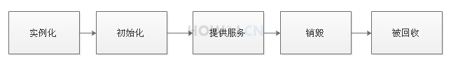
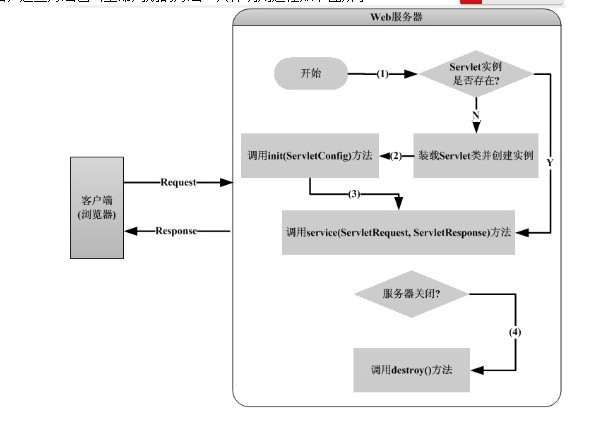
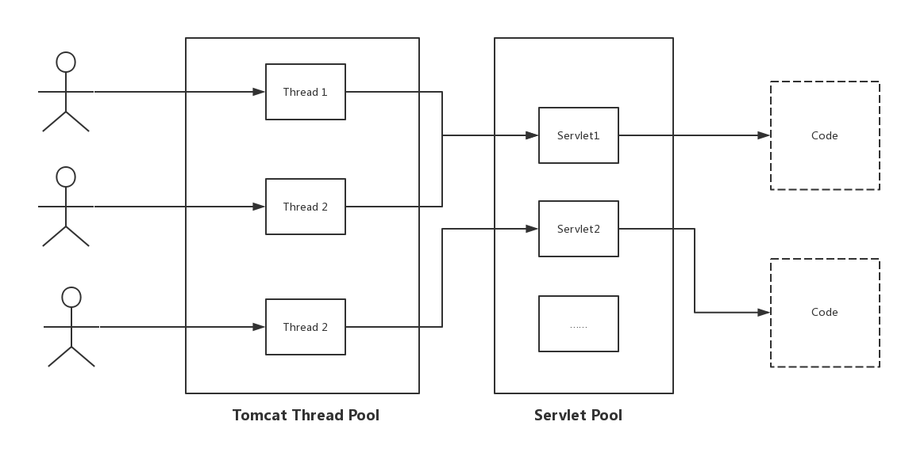
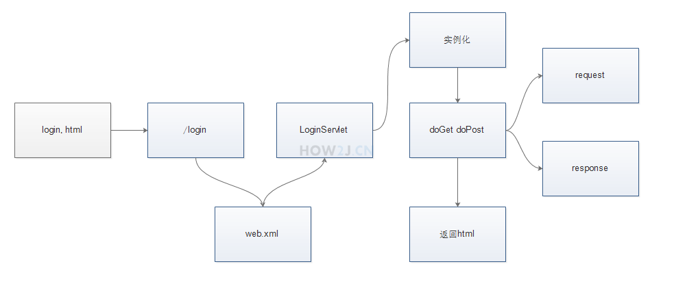
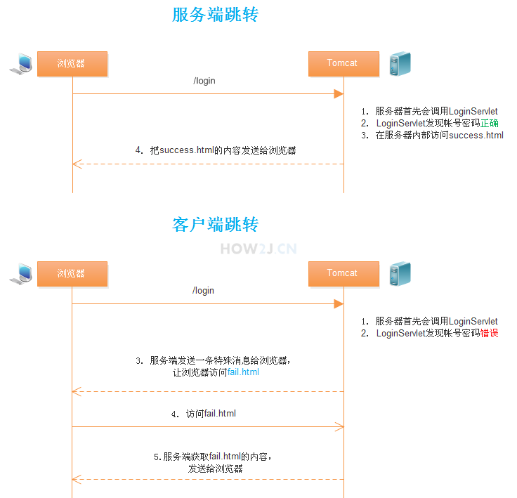

[TOC]

<u>Servlet 是 J2EE 最重要的一部分</u>，有了 Servlet 你就是 J2EE 了，J2EE 的其他方面的内容择需采用。而 Servlet 规范你需要掌握的就是 servlet 和 filter 这两项技术。绝大多数框架不是基于 servlet 就是基于 filter，如果它要在 Servlet 容器上运行，就永远也脱离不开这个模型。

## 生命周期

https://my.oschina.net/xianggao/blog/395327

http://www.cnblogs.com/cuiliang/archive/2011/10/21/2220671.html

直接来看，一个Servlet的生命周期由 实例化，初始化，提供服务，销毁，被回收 几个步骤组成；



实例化，也就是创建 / 装载 Servlet对象的时机

1. 默认情况下，在Servlet **容器**启动后：客户首次向Servlet发出请求，Servlet容器会判断内存中是否存在指定的Servlet对象，如果没有则创建它，然后根据客户的请求创建HttpRequest、HttpResponse对象，从而调用Servlet对象的service方法；

2. Servlet容器启动时：当web.xml文件中如果`<servlet>`元素中指定了`<load-on-startup>`子元素时，Servlet容器在启动web服务器时，将按照顺序**创建并初始化Servlet对象；** Servlet容器在启动时自动创建Servlet，这是由在web.xml文件中为Servlet设置的`<load-on-startup>`属性决定的。

   ```xml
   <loadon-startup>1</loadon-startup> # 1 表示第一个被创建并初始化；取值范围是1-99
   ```

3. Servlet的类文件被更新后，重新创建Servlet。

4. 总结：从中我们也能看到同一个类型的Servlet对象在Servlet容器中以**单例**的形式存在；

Servlet的典型生命周期

1. 初始化，init(ServletConfig)方法：负责初始化Servlet对象，在Servlet的生命周期中，该方法执行一次；<u>**该方法（init()）**执行在单线程的环境下，因此开发者不用考虑线程安全的问题</u>；初始化的目的是为了让Servlet对象在处理客户端请求前完成一些初始化的工作，如建立数据库的连接，获取配置信息等。在初始化期间，Servlet实例可以使用容器为它准备的ServletConfig对象从Web应用程序的配置信息（在web.xml中配置）中获取初始化的参数信息。
2. 提供服务，service(ServletRequest req,ServletResponse res)方法：负责响应客户的请求；为了提高效率，Servlet规范要求一个Servlet实例必须能够同时服务于多个客户端请求，即**service()方法运行在多线程的环境下，Servlet开发者必须保证该方法的线程安全性；**
3. 销毁，destroy()方法：**Servlet容器停止或者重新启动** ，也就是当Servlet对象退出生命周期时，负责释放占用的资源；

在整个Servlet的生命周期过程中，创建Servlet实例、调用实例的init()和destroy()方法都只进行一次，当初始化完成后，Servlet容器会将该实例保存在内存中，通过调用它的service()方法，为接收到的请求服务。下面给出Servlet整个生命周期过程的UML序列图，如图所示。


从客户端与web服务器的交互来看，




Servlet容器如何知道创建哪一个Servlet对象？Servlet对象如何配置？实际上这些信息是通过读取web.xml配置文件来实现的。

### 自启动

有的时候会有这样的业务需求： 
tomcat一启动，就需要执行一些初始化的代码，比如校验数据库的完整性等。

对于这种需求，可以利用web.xml的`<load-on-startup>`配置节信息，对HelloSevlet增加一句`<load-on-startup>10</load-on-startup>` ， 然后在该servlet的init()方法中执行初始化代码

**缺点：** web.xml中的listener、servlet 可以在tomcat启动后执行 但不能注解

如果想在tomcat启动后自动执行SSM框架中带注解的操作，可以在spring-mvc.xml中添加一个bean，设置其init-method 属性即可 [reference](https://blog.csdn.net/qq_30264689/article/details/80683764)

### [servlet 是线程安全的吗？](https://www.cnblogs.com/chanshuyi/p/5052426.html)

不是，首先需要了解Servlet容器（即Tomcat）使如何响应HTTP请求的。

当Tomcat接收到Client的HTTP请求时，Tomcat从线程池中取出一个线程，之后找到该请求对应的Servlet对象并进行初始化，之后调用service()方法。要注意的是每一个Servlet对象再Tomcat容器中只有一个实例对象，即是单例模式。如果多个HTTP请求请求的是同一个Servlet，那么着两个HTTP请求对应的线程将**并发调用Servlet**的service()方法。

**此时如果Servlet中定义了实例变量或静态变量，那么可能会发生线程安全问题**（因为所有的线程都可能使用这些变量）。



## web.xml 配置

web.xml提供路径与servlet的映射关系

<servlet> 标签下的 <servlet-name>  与 <servlet-mapping> 标签下的 <servlet-name> 必须一样

<servlet-name>与<servlet-class>可以不一样，但是为了便于理解与维护，一般都会写的一样。 一目了然

```xml
<!-- 最简单的servlet配置 -->
<servlet>
  <!-- Servlet对象的名称 -->
  <servlet-name>HelloServlet</servlet-name>
  <!-- 创建Servlet对象所要调用的类 -->
  <servlet-class>HelloServlet</servlet-class>
</servlet>

<servlet-mapping>
  <!-- 要与servlet中的servlet-name配置节内容对应 -->
  <servlet-name>HelloServlet</servlet-name>
  <!-- 客户访问的Servlet的相对URL路径 -->
  <url-pattern>/hello</url-pattern>
</servlet-mapping>

<!-- 复杂的servlet配置 -->
<servlet>
    <servlet-name>action<servlet-name>
    <servlet-class>org.apache.struts.action.ActionServlet</servlet-class>
    <init-param>
        <!-- 参数名称 -->
        <param-name>config</param-name>
        <!-- 参数值 -->
        <param-value>/WEB-INF/struts-config.xml</param-value>
    </init-param>
    <init-param>
        <param-name>detail</param-name>
        <param-value>2</param-value>
    </init-param>
    <init-param>
        <param-name>debug</param-name>
        <param-value>2</param-value>
    </init-param>
    <!-- Servlet容器启动时加载Servlet对象的顺序 -->
    <load-on-startup>2</load-on-startup>
</servlet>
<servlet-mapping>
    <servlet-name>action</servlet-name>
    <url-pattern>*.do</url-pattern>
</servlet-mapping>
```

​	当Servlet容器启动的时候读取`<servlet>`配置节信息，根据`<servlet-class>`配置节信息创建Servlet对象，同时根据`<init-param>`配置节信息创建HttpServletConfig对象，然后执行Servlet对象的init方法，并且根据`<load-on-startup>`配置节信息来决定创建Servlet对象的顺序，如果此配置节信息为负数或者没有配置，那么在Servlet容器启动时，将不加载此Servlet对象。当客户访问Servlet容器时，Servlet容器根据客户访问的URL地址，通过`<servlet-mapping>`配置节中的`<url-pattern>`配置节信息找到指定的Servlet对象，并调用此Servlet对象的service方法。

##指定项目输出到classes目录

**为什么要有这一步？** 在ecilpse中默认输出的class是在bin目录下，但是tomcat启动之后，在默认情况下，不会去bin目录找这些class文件，而是到WEB-INF/classes这个目录下去寻找。 所以通过这一步的配置，使得eclipse的class文件输出到WEB-INF/classes目录下，那么这样就**和tomcat兼容**了。 **IDEA也是如此**

##[get 与 post 的区别](https://www.cnblogs.com/ranyonsue/p/5984001.html)

1. 使用method="get" 提交数据 是常用的提交数据的方式；如果form元素没有提供method属性，**默认**就是get方式提交数据；get方式的一个特点就是，可以在浏览器的地址栏看到提交的参数，即便是密码也看得到（所以使用get方式提交数据，安全性较低）；如果数据是英文字母/数字，原样发送，如果是空格，转换为+，如果是中文/其他字符，则直接把字符串用BASE64加密，得出如： %E4%BD%A0%E5%A5%BD，其中％XX中的XX为该符号以16进制表示的ASCII。

2. 使用method="post" 也可以提交数据，post不会在地址栏显示提交的参数 ，如果要提交二进制数据，比如**上传文件**，必须采用post方式；提交的数据放置在是HTTP包的包体中。

3. get 与 post 的区别

   **get**  所以该Servlet需要提供一个对应的doGet方法
   是form默认的提交方式 
   如果通过一个超链访问某个地址，是get方式 
   如果在地址栏直接输入某个地址，是get方式 ，ajax指定使用get方式的时候
   提交数据会在浏览器显示出来 
   不可以用于提交二进制数据，比如上传文件 

   **post** 所以对应的Servlet需要提供一个doPost方法
   必须在form上通过 method="post" 显示指定，ajax指定使用post方式的时候
   提交数据不会在浏览器显示出来 
   可以用于提交二进制数据，比如上传文件

```html
<!--action="login" 标题会提交到login路径，login路径在后续步骤会映射到LoginServlet-->
<!--method="post" post方式表示提交的密码信息在浏览器地址栏看不到-->
<form action="login" method="post">
账号: <input type="text" name="name"> <br>
密码: <input type="password" name="password"> <br>
<input type="submit" value="登录">
</form>
```

## HttpServletRequest 和 HttpServletResponse

为什么我这么强调 HttpServletRequest 和 HttpServletResponse 这两个接口，因为 Web 开发是离不开 HTTP 协议的，而 Servlet 规范其实就是对 HTTP 协议做面向对象的封装，HTTP协议中的请求和响应就是对应了 HttpServletRequest 和 HttpServletResponse 这两个接口。

你可以通过 HttpServletRequest 来获取所有请求相关的信息，包括 URI、Cookie、Header、请求参数（form中或者url中数据）等等，别无它路。因此当你使用某个框架时，你想获取HTTP请求的相关信息，只要拿到 HttpServletRequest 实例即可。

而 HttpServletResponse接口是用来生产 HTTP 回应，包含 Cookie、Header 以及回应的内容等等。

### 注：

前台向servlet传参有两种方式，一种是使用表单form，一种是通过url；servlet接收参数是唯一的，都是`request.getParameter("name")`

##Service()

Servlet 需要提供对应的doGet() 与 doPost()方法

###doPost()

因为浏览器中的form的method是post,所以LoginServlet需要提供一个doPost方法

在doPost方法中，通过request.getParamter 根据name取出对应的参数

```java
protected void doPost(HttpServletRequest request, HttpServletResponse response)
  throws ServletException, IOException {
  String name = request.getParameter("name");
  String password = request.getParameter("password");
  ...

}
```

###doGet()

```java
public void doGet(HttpServletRequest request, HttpServletResponse response){
    ...
}
```

###service()

Servlet继承了HttpServlet,同时也继承了一个方法 `service(HttpServletRequest , HttpServletResponse )`，实际上，在执行doGet()或者doPost()之前，都会先执行service()

**由service()方法进行判断，到底该调用doGet()还是doPost()**

可以发现，service(), doGet(), doPost() 三种方式的参数列表都是一样的。

所以，**有时候也会直接重写service()方法，在其中提供相应的服务，就不用区分到底是get还是post了。**

##调用流程



##中文编码

###获取中文的参数

1. html页面设置`<meta http-equiv="Content-Type" content="text/html; charset=UTF-8">` ，form的method修改为post

2. 在servlet进行解码和编码

   1. 繁琐的方式

      ```java
      byte[] bytes=  name.getBytes("ISO-8859-1");
      name = new String(bytes,"UTF-8");
      ```

   2. 简洁的方式，放在request.getParameter()之前

      ```java
      request.setCharacterEncoding("UTF-8"); 
      ```

   以上是使用UTF-8的方式获取中文呢。 也可以使用GBK。把所有的UTF-8替换为GBK即可。 GB2312同理。


###返回中文的响应 

在Servlet中，加上

```java
response.setContentType("text/html; charset=UTF-8");
```

## 跳转

跳转的方式有两种，服务端跳转和客户端跳转

### 服务端跳转

在Servlet中进行服务端跳转的方式：

`request.getRequestDispatcher("success.html").forward(request, response); `

服务端跳转可以看到浏览器的地址依然是/login 路径，并不会变成success.html

### 客户端跳转

在Servlet中进行客户端跳转的方式（302 临时跳转的方式）：

 `response.sendRedirect("fail.html");`

301要使用另外的手段： 

`response.setStatus(301);`

`response.setHeader("Location", "fail.html");`

可以观察到，浏览器地址发生了变化，变为.../fail.html

页面的路径是相对路径。sendRedirect可以将页面跳转到任何页面，不一定局限于本web应用中，如： 
response.sendRedirect("http://www.baidu.com"); // 别忘了写 **http://**

该方法通过修改HTTP协议的HEADER部分,对浏览器下达重定向指令的，让浏览器对在location中指定的URL提出请求，使浏览器显示重定向网页的内容。

该方法可以接受绝对的或相对的URLs。如果传递到该方法的参数是一个相对的URL，那么Web container在将它发送到客户端前会把它转换成一个绝对的URL。

###两者区别



## Request常用用法

###request的常见方法

request.getRequestURL(): 浏览器发出请求时的完整URL，包括协议 主机名 端口(如果有)" + 
request.getRequestURI(): 浏览器发出请求的资源名部分，去掉了协议，主机名和port。例如访问`http://localhost:8080/`，资源名部分就是 `/ `
request.getQueryString(): 请求行中的参数部分，只能显示以get方式发出的参数，post方式的看不到
request.getRemoteAddr(): 浏览器所处于的客户机的IP地址
request.getRemoteHost(): 浏览器所处于的客户机的主机名
request.getRemotePort(): 浏览器所处于的客户机使用的网络端口
request.getLocalAddr(): 服务器的IP地址
request.getLocalName(): 服务器的主机名
request.getMethod(): 得到客户机请求方式一般是GET或者POST

### 获取参数

request.getParameter(): 是常见的方法，用于获取单值的参数
request.getParameterValues(): 用于获取具有多值得参数，比如注册的时候提交的爱好，可以使多选的。
request.getParameterMap(): 用于遍历所有的参数，并返回Map类型。

### 获取头信息

request.getHeader() 获取浏览器传递过来的头信息。 
比如getHeader("user-agent") 可以获取浏览器的基本资料，这样就能判断是firefox、IE、chrome、或者是safari浏览器
request.getHeaderNames() 获取浏览器所有的头信息名称，根据头信息名称就能遍历出所有的头信息

##Response用法

### 设置响应内容

通过response设置响应已经用得比较多了，在前面的Servlet学习中都是用到
`PrintWriter pw= response.getWriter();`
通过response.getWriter(); 获取一个PrintWriter 对象
可以使用println(),append(),write(),format()等等方法设置返回给浏览器的html内容。

### 设置响应格式

`response.setContentType("text/html");`

### 设置响应编码

设置响应编码有两种方式

1. `response.setContentType("text/html; charset=UTF-8");`
2. `response.setCharacterEncoding("UTF-8");`

这两种方式都需要在response.getWriter调用之前执行才能生效。

### 设置不使用缓存

## 作用域

request HTTP请求开始到结束这段时间
session HTTP会话开始到结束这段时间
application 服务器启动到停止这段时间

### request

利用`HttpServletRequest` 的setAttribute()和getAttribute()

设置好信息后，如何转发给其他servlet 或者 jsp?使用上文讲到的jsp的两种跳转方式就行了。

### session

session是通过HttpSession接口实现的；同样有getAttribute() 和 setAttribute()方法

通过`HttpServletRequest.getSession()`方法可以获得 HttpSession 对象。

### application

application通过ServletContext 实现；

通过`HttpSessionEvent.getSession().getServletContext();` 方法可以获得ServletContext 对象

​	 

