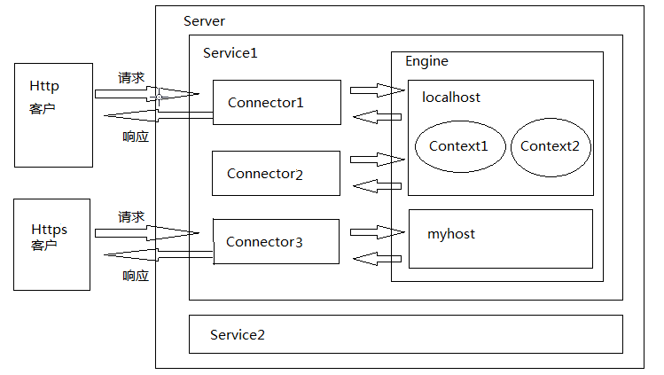

## Tomcat VS Apache

### [Server](https://zhuanlan.zhihu.com/p/22544725 )

1. 什么是Server？server 可以代指硬件或软件，然而它们都是协同工作的。对于开发者来说，一般指的是后者，也就是一个 24 小时运行的软件程序。
2. [什么是Web Server？](https://developer.mozilla.org/zh-CN/docs/Learn/Common_questions/What_is_a_web_server)（仅从软件角度考虑）提供 Web 服务的 Server。
   1. 一个 Web Server 包括几个控制网络用户如何访问托管文件的部分，至少是一个 HTTP 服务器 [*HTTP server*]。一个 HTTP 服务器是一个能理解URLs (网络地址) 和 HTTP (你的浏览器查看网页时所用的协议) 的软件。
   2. 在最基础的层次，每当一个浏览器需要一个网络服务器上的托管文件时，浏览器会通过 HTTP 请求这个文件。当这个请求到达了正确的网络服务器（硬件），这个 HTTP 服务器（软件）返回所请求的文档，同样通过 HTTP。
   3. 要发布一个网站，你需要一个静态或动态的服务器。
3. 分类：
   1. Static Web Server：由一个计算机（硬件）和一个 HTTP 服务器（软件）组成。我们称它为 “**静态**” 因为这个服务器把它的托管文件 “**保持原样**” 地传送到你的浏览器。如 Apache
   2. Dynamic Web Server：由一个静态的网络服务器加上额外的软件组成，最普遍的是 *application server* + *database* （例如：Tomcat + Mysql）。我们称它为 “**动态**” 因为这个应用服务器会在通过 HTTP 服务器传送托管文件到你的浏览器之前对这些托管文件进行**更新**。

### Apache

APACHE 是一个web服务器环境程序 启用他可以作为web服务器使用 不过只支持静态网页 如(asp,php,cgi,jsp)等动态网页的就不行 

### Tomcat

它只是一个 servlet (jsp也翻译成servlet)容器，可以认为是 Apache 的扩展，但是**可以独立于 Apache 运行**

### 相同点

1. 两者都是**Apache组织**开发的 
2. 两者都有 HTTP 服务的功能 
3. 两者都是免费的 

### 区别

1. Apache是Web服务器，Web服务器传送(serves)页面使浏览器可以浏览，Web服务器专门处理HTTP请求(request)，但是应用程序服务器是通过很多协议来为应用程序提供 (serves)商业逻辑(business logic)。Tomcat是运行在Apache上的应用服务器，应用程序服务器提供的是客户端应用程序可以调用(call)的方法 (methods)。它只是一个servlet(jsp也翻译成servlet)容器，可以认为是Apache的扩展，但是可以独立于apache运行。
2. Apache是普通服务器，本身只支持html静态普通网页。不过可以通过插件支持PHP，还可以与Tomcat连通(单向Apache连接Tomcat,就是说通过Apache可以访问Tomcat资源，反之不然)，Tomcat是jsp/servlet容器，同时也支持HTML、JSP、ASP、PHP、CGI等，其中CGI需要一些手动调试，不过很容易的。
3. Apache侧重于http server，Tomcat侧重于servlet引擎，如果以standalone方式运行，功能上Tomcat与apache等效支持JSP，但对静态网页不太理想。
4. Apache可以运行一年不重启，稳定性非常好，而Tomcat则不见得。
5. 首选web服务器是Apache，但Apache解析不了的jsp、servlet才用tomcat。
6. Apache是做开始的页面解析服务，tomcat是后研发出来的，从本质上来说tomcat的功能完全可以替代Apache，但Apache毕竟是tomcat的前辈级人物，并且市场上也有不少人还在用Apache，所以Apache还会继续存在，不会被取代，apache不能解析java的东西，但解析html速度快。

### 两者整合

Apache是一个web服务器环境程序，启用他可以作为web服务器使用不过只支持静态网页，不支持动态网页，如asp、jsp、php、cgi

如果要在Apache环境下运行jsp就需要一个解释器来执行jsp网页，而这个jsp解释器就是Tomcat

那为什么还要JDK呢？因为jsp需要连接数据库的话就要jdk来提供连接数据库的驱程，所以要运行jsp的web服务器平台就需要APACHE+TOMCAT+JDK

整合的好处：

1. 如果客户端请求的是静态页面，则只需要Apache服务器响应请求
2. 如果客户端请求动态页面，则是Tomcat服务器响应请求
3. 因为jsp是服务器端解释代码的，这样整合就可以减少Tomcat的服务开销

### links

1. https://zhuanlan.zhihu.com/p/22544725 
2. https://developer.mozilla.org/zh-CN/docs/Learn/Common_questions/What_is_a_web_server
3. https://www.cnblogs.com/warioland/archive/2011/12/05/2276729.html
4. https://blog.csdn.net/ithomer/article/details/7839906

## 改端口

修改server.xml，将8080替换为别的端口号。

## 端口被占用了怎么办？

### 查看80端口被哪些程序占用了

```powershell
netstat -ano|findstr "80"
```

### 根据pid（进程id） 查询对应的应用程序

```powershell
tasklist|findstr "1828"
```

### 根据名称 结束该程序

```powershell
taskkill /f /t /im java.exe
```

## Tomcat 问题排查

### JAVA_HOME

现象：点击startup.bat之后，屏幕一闪而过
检验：如图所示, 首先通过cmd命令进入控制台，然后切换到对应的目录执行startup命令，得到JRE_HOME environment .... 这么个提示，就表示JAVA_HOME环境变量没有设置。
分析：**Tomcat本身是JAVA程序**，必须要有JDK才可以执行，所以必须配置JAVA_HOME。

### CATALINA_HOME未设置

现象：点击startup.bat之后，屏幕一闪而过
检验：如图所示, 首先通过cmd命令进入控制台，然后切换到对应的目录执行startup命令，得到CATALINA_HOME environment .... 这么个提示，就表示CATALINA_HOME环境变量设置错误。
分析：Tomcat执行必须依赖CATALINA_HOME或者CATALINA_BASE这两个环境变量。 如果没有在环境变量里配置过，那么会自动采用bin目录的父目录作为CATALINA_HOME和CATALINA_BASE。 如果配置了，而所配置的地方又不是正确的TOMCAT目录，那么就会出现这个错误。
解决：

1. 在环境变量中删除CATALINA_HOME,CATALINA_BASE的配置，记得不仅要检查环境变量，还要检查用户变量。
2. 或者把CATALINA_HOME设置为正确的TOMCAT目录。

###localhost.yyyy-mm-dd.log

当server.xml， web.xml配置错误的时候，当前web应用就会部署失败，并且会将错误信息输出到localhost.yyyy-mm-dd.log文件中。根据实际情况分析。

### JDK版本

现象：404错误，明明有文件，但是就是不能访问。
检验：在命令行中运行java -version 检查一下当前java的版本
分析：当部署的web应用中的类是由高版本JDK编译生成，而当前tomcat运行所使用的JDK又是低版本的话，就会报出如图所示的错误：**UnsupportedClassVersionError**，进而导致web应用启动失败。

## 404问题

404表示File Not Found， 文件不存在错误。

### webapps下的ROOT目录

有的时候，在server.xml 中配置的<context 是以“/"为开始路径的，与此同时，在webapps目录下还存在一个ROOT目录，这个ROOT目录其实也是告诉tomcat，以“/” 为开始路径，那么这样就发生冲突了，Tomcat只能二选一，通常情况下都会选择ROOT目录，那么在server.xml中配置的就<context 就无法启动了，导致访问对应的资源提示404错误。
解决办法就是**删除掉ROOT目录**，或者**把ROOT目录重命名**，或者**给定server.xml中配置的<context 的path值不为“/”**


##Tomcat 组成

[Tomcat结构及处理请求过程](http://objcoding.com/2017/06/12/Tomcat-structure-and-processing-request-process/)

[tomcat中server.xml配置详解](https://blog.csdn.net/zcyhappy1314/article/details/10356909)




##Container组成


##Tomcat 的启动过程


