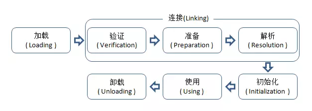

# 学习资料

1. [Java虚拟机类加载机制](http://www.importnew.com/18548.html)
2. [Java虚拟机类加载机制——案例分析Java虚拟机类加载机制——案例分析](http://www.importnew.com/18566.html)
3. [Java提高篇——静态代码块、构造代码块、构造函数以及Java类初始化顺序](https://www.cnblogs.com/Qian123/p/5713440.html)


# 程序的输出结果是啥？

自己绉的题，给一段程序，问输出结果是啥？

```java
class HelloA {
  public HelloA(){//构造函数
    System.out.println("A的构造函数");
  }
  {//构造代码块
    System.out.println("A的构造代码块");
  }
  static {//静态代码块
    System.out.println("A的静态代码块");
  }
}
class HelloB extends HelloA{
  public HelloB(){//构造函数
    System.out.println("B的构造函数");
  }
  {//构造代码块
    System.out.println("B的构造代码块");
  }
  static {//静态代码块
    System.out.println("B的静态代码块");
  }
}

public class test {
  static HelloB b = new HelloB();
  static {
    System.out.println("over~");
  }
  {
    System.out.println("1");
  }
  test() {
    System.out.println("2");
  }
  public static void main(String[] args) {
  }
}
```

输出结果：

```c
A的静态代码块
B的静态代码块
A的构造代码块
A的构造函数
B的构造代码块
B的构造函数
over~
```

## 代码执行步骤

1. 首先在执行此段代码时，由main方法的调用触发 test 类的加载过程，首先是 test 类的静态初始化；

2. 在初始化 test 类的静态部分时，先遇到了 b ，这个成员变量引用的是 HelloB 类的实例；

3. 所以下面就是实例化HelloB，HelloB继承自HelloA，

4. 当涉及到继承时，按照如下顺序执行：

   1. 执行父类的静态代码块，并初始化父类静态成员变量
   2. 执行子类的静态代码块，并初始化子类静态成员变量
   3. 执行父类的构造代码块，执行父类的构造函数，并初始化父类普通成员变量
   4. 执行子类的构造代码块， 执行子类的构造函数，并初始化子类普通成员变量

5. 至此，输出结果是

   ```
   A的静态代码块
   B的静态代码块
   A的构造代码块
   A的构造函数
   B的构造代码块
   B的构造函数
   ```

6. 现在代码继续初始化 test 类的静态部分，遇到了静态代码块，输出“over~”，然后执行main函数，该函数为空，至此代码执行结束；

7. 因为不涉及到test类的实例化，所以test类中的构造代码块和构造函数都没有执行。

实际考察的是Java 的类加载机制。为了得到程序执行的正确结果，就需要研究下它。

# 类加载过程

类从被加载到虚拟机内存中开始，到卸载出内存为止，它的整个生命周期包括：加载（Loading）、验证（Verification）、准备(Preparation)、解析(Resolution)、初始化(Initialization)、使用(Using)和卸载(Unloading)7个阶段。其中准备、验证、解析3个部分统称为连接（Linking）。如图所示。



只有在准备阶段和初始化阶段才会涉及类变量的初始化和赋值.

### 准备

准备阶段是正式为<u>类变量</u>分配内存并设置类变量初始值的阶段，这些变量所使用的内存都将在**方法区**中进行分配。这时候进行内存分配的仅包括类变量（被static修饰的变量），而不包括实例变量，实例变量将会在对象实例化时随着对象一起分配在堆中。其次，这里所说的初始值“通常情况”下是数据类型的**零值**，假设一个类变量的定义为：

```java
public static int value=123;
```

那变量value在准备阶段过后的初始值为0而不是123.因为这时候尚未开始执行任何java方法，而把value赋值为123的putstatic指令是程序被编译后，存放于类构造器()方法之中，所以把value赋值为123的动作将在初始化阶段才会执行。
至于“特殊情况”是指：public static final int value=123，即当类字段的字段属性是ConstantValue时，会在准备阶段初始化为指定的值，所以标注为final之后，value的值在准备阶段初始化为123而非0.

### 初始化

在堆栈信息中可以看到，对象的构造方法是<init>()，类的构造方法是<clinit>()。

类初始化阶段是类加载过程的最后一步，到了初始化阶段，才真正开始执行类中定义的java程序代码。在准备阶段，变量已经赋过一次系统要求的初始值，而在初始化阶段，则根据程序猿通过程序制定的主管计划去初始化类变量和其他资源，或者说初始化阶段是执行类构造器<clinit>()方法的过程.

<clinit>()方法与实例构造器<init>()方法不同，它不需要显示地调用父类构造器，**虚拟机会保证在子类<init>()方法执行之前，父类的<clinit>()方法方法已经执行完毕**。

实例初始化不一定要在类初始化结束之后才开始初始化。

## Small Tips

静态代码块：用static声明，jvm加载类时执行，仅执行一次

静态变量：static 修饰的变量，又称类变量

构造代码块：类中直接用{}定义，每一次创建对象时执行，而且优先于构造函数执行。这里要强调一下，有对象建立，才会运行构造代码块，类不能调用构造代码块