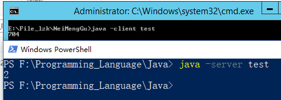

1. [内存泄漏与内存溢出](https://www.cnblogs.com/wzyxidian/p/5860473.html)
   1. **内存泄露是指无用对象（不再使用的对象）持续占有内存或无用对象的内存得不到及时释放，从而造成的<u>内存空间的浪费称为内存泄露</u>。**内存泄露有时不严重且不易察觉，这样开发者就不知道存在内存泄露，但有时也会很严重，会提示 你Out of memory。
   2. 内存溢出（OOM?）指程序运行过程中**无法申请到足够的内存**而导致的一种错误。**内存泄露是内存溢出的一种诱因**，不是唯一因素
   3. Java内存泄露根本原因是什么呢？**长生命周期的对象持有短生命周期对象的引用就很可能发生内存泄露，**尽管短生命周期对象已经不再需要，但是因为长生命周期对象持有它的引用而导致不能被回收，这就是java中内存泄露的发生场景。

2. [JVM 新生代为何需要两个 Survivor 空间？](http://dsxwjhf.iteye.com/blog/2201687)

   1. 为什么要有Survivor空间？设置 Survivor 空间的目的是让那些中等寿命的对象尽量在 Minor GC 时被干掉，从而减少Full GC的次数，最终在总体上减少虚拟机的垃圾收集过程对用户程序的影响。 
   2. 为什么不是1个Survivor？如果只有1个 Survivor 空间，此时新生代只有Eden区和Survivor两部分，因为新生代通常采用“复制”算法，那么新生代空间满一半的时候就会触发一次 Minor GC 。
   3. 我们可以设两个 Survivor 空间（ From Survivor 和 To Survivor ）。比如，我们把 Eden : From Survivor : To Survivor 空间大小设成 8 : 1 : 1 ，对象总是在 Eden 区出生， From Survivor 保存当前的幸存对象， To Survivor 为空。一次 gc 发生后： 
      1. Eden 区活着的对象 ＋ From Survivor 存储的对象被复制到 To Survivor（如果放不下就放在老年代） ； 
      2. 清空 Eden 和 From Survivor ； 
      3. 颠倒 From Survivor 和 To Survivor 的逻辑关系： From 变 To ， To 变 From 。 
   4. 可以看出，只有在 Eden 空间快满的时候才会触发 Minor GC 。而 Eden 空间占新生代的绝大部分，所以 Minor GC 的频率得以降低。

3. [Java 慢在哪里？](http://www.cnblogs.com/nucdy/p/6702726.html)

   1. 解释性语言固有开销：java程序在运行时类加载器从类路经中加载相关的类,然后java虚拟机读取该类文件的字节,执行相应操作.而C 编译的时候将程序编译成本地机器码.一般来说java程序执行速度要比C 慢10-30倍.即使采用just-in-time compiling (读取类文件字节后,编译成本地机器码)技术,速度也要比C 慢好多.
   2. 字节码加载执行开销：java程序要从网络上加载类字节,然后执行,这也是导致java运行速度慢的原因.
   3. 运行时溢出检测开销：在程序运行过程中,java虚拟机要检测数组是否越界,在C 中则不检测.
   4. 运行时引用检测开销：java在运行过程中检测对象的引用是否为空,如果引用指向都空指针,且执行某个方法时会抛出空指针异常
   5. 运行时类型检测开销：java运行时对类型检测,如果类型不正确会抛出ClassCastException异常.
   6. 堆与栈的区别：java中所有的对象都创建在堆中,没有对象被创建在stack中,而C 有的对象和变量是创建在stack中的
   7. GC巨大开销：java的垃圾回收机制较C 由程序员管理内存效率更低.
   8. [类型转换开销](https://www.javaworld.com/article/2076555/build-ci-sdlc/java-performance-programming--part-2--the-cost-of-casting.html)：向上转型（隐式转换）不会造成开销，而向下转型（显示转换）会带来开销。
   9. String类型开销：在java中String 是UNICODE.当java要操作一个 ASCII string 时,比C 效率上相对要低一些.
   10. 动态链接开销：java中采用的是动态链接；动态链接：在运行时进行链接以便运行，但外部函数在被真正调用之前，运行时载入器并不解析他们。所以即使链接了函数库，如果并没有实际调用，也不会再来额外内存开销，但是增加了性能开销，调用动态链接库中的函数，需要好几次间接内存访问才能走到函数入口，全局数据也是。

4. [Java 快在哪里？](https://stackoverflow.com/questions/2163411/is-java-really-slow)

   1. 内存分配和取消分配
   2. 对象实例化、面向对象的特性使用起来非常快
   3. Method calls are basically free and in some cases faster than large-method code.
   4. 同步和多线程简单而有效。
   5. 字符串包括长度：某些操作更快。
   6. 数组拷贝经过高度优化。
   7. JIT 编译器很聪明地使用L1 / L2缓存 。

5. [JVM Server & Client 运行模式](https://my.oschina.net/itblog/blog/507822)

   1. 当虚拟机运行在-client模式的时候,使用的是一个代号为C1的轻量级编译器, 而-server模式启动的虚拟机采用相对重量级,代号为C2的编译器. C2比C1编译器**编译的相对彻底**,所以 -Server模式**启动**时，速度较慢，但是一旦 **运行** 起来后，性能将会有很大的提升。

   2. 其实说Server和Client是JVM的两种工作模式是不准确的，因为它们就是不同的虚拟机，因此应该说有两种类型的JVM。

   3. 两个JVM是使用的不同编译器。Client JVM适合需要快速启动和较小内存空间的应用，它适合交互性的应用，比如GUI；而Server JVM则是看重执行效率的应用的最佳选择。不同之处包括：编译策略、默认堆大小、内嵌策略。

   4. Server 模式的运行速度比Client模式快很多很多；以以下代码为例，其中client模式是在服务器上运行的；它展示了二者执行的效率

      ```java
      public class test {
        public static void main(String[] args) {
          long start = System.currentTimeMillis();
          spendTime();
          long end = System.currentTimeMillis();
          System.out.println(end-start);
        }

        private static void spendTime() {
          for (int i =500000000;i>0;i--) {
          }
        }
      }
      ```

      ​

      

   5.  两种运行模式的安装：目前64位的 JVM 只支持server模式；在Windows系统中，32位默认只提供client，如果要切换到Server，需要自行下载JDK。（For 32-bit Windows, if you download the JRE, you get only the client, you'll need to download the SDK to get both systems.）

6. ​