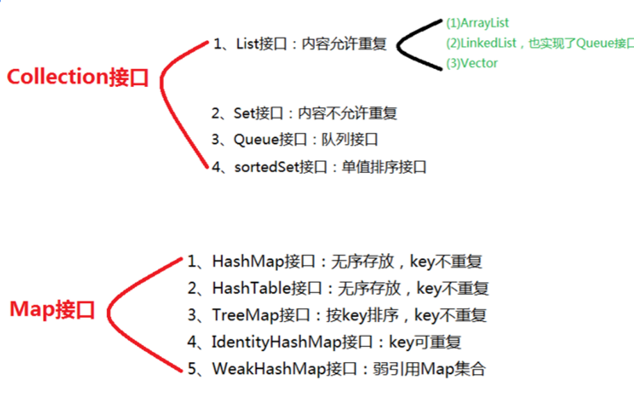

### Collection

#### ArrayList

1. 线性列表

2. permits all elements, including `null` 所以在indexOf(Object o)、lastIndexOf(Object o)、remove(Object o) 中这样比较 `o==null ? get(i)==null : o.equals(get(i))`

3. This class is roughly equivalent to **Vector**, except that it is unsynchronized.

4. This is typically accomplished by synchronizing on some object that naturally encapsulates the list. Can be wrapped using `Collections.synchronizedList`

5. The iterators are fail-fast. 迭代器的的Fail-fast功能,只是尽可能的抛出ConcurrentModificationException这一异常.

6. ​

7. ```java

   DEFAULTCAPACITY_EMPTY_ELEMENTDATA // 共享空数组实例，用于Shared empty array instance used for default sized empty instances.
   EMPTY_ELEMENTDATA
   int newCapacity = oldCapacity + (oldCapacity >> 1); // 按照1.5倍进行扩容
   // toArray(T[] a)
   if (a.length > size) // If the list fits in the specified array with room to spare, the element in the array immediately following the end of the collection is set to null. 可以让调用者知道数组中含有的list数据的实际大小
     a[size] = null;
   // remove(int index)
   elementData[--size] = null; // clear to let GC do its work 因为ArrayList中的元素是引用数据类型，将引用置为空，有利于内存回收
   // Private remove method that skips bounds checking and does not return the value removed. 私有的remove方法，跳过了边界检查并且没有返回值
   private void fastRemove(int index)
   ```

8. ```java
   // shallow copy
   clone();
   // shallow copy
   // bridge between array-based and collection-based
   Object[] toArray();
   // 集合转数组
   T[] toArray(T[] a);
   /**
    * Increases the capacity to ensure that it can hold at least the
    * number of elements specified by the minimum capacity argument.
    *
    * @param minCapacity the desired minimum capacity
    */
   private void grow(int minCapacity) {
     // overflow-conscious code
     int oldCapacity = elementData.length;
     int newCapacity = oldCapacity + (oldCapacity >> 1);
     if (newCapacity - minCapacity < 0)
       newCapacity = minCapacity;
     if (newCapacity - MAX_ARRAY_SIZE > 0)
       newCapacity = hugeCapacity(minCapacity);
     // minCapacity is usually close to size, so this is a win:
     elementData = Arrays.copyOf(elementData, newCapacity);
   }
   /**
   * Trims the capacity of this <tt>ArrayList</tt> instance to be the
   * list's current size.  An application can use this operation to minimize
   * the storage of an <tt>ArrayList</tt> instance.
   */
   public void trimToSize() {
     modCount++;
     if (size < elementData.length) {
       elementData = (size == 0)
         ? EMPTY_ELEMENTDATA
         : Arrays.copyOf(elementData, size);
     }
   }
   // 批量删除
   private boolean batchRemove(Collection<?> c, boolean complement);
   // 不管调用set方法还是add方法,ArrayList实例通过迭代器输出的内容都不会改变.
   // 其中的forEachRemaining(Consumer<? super E> consumer)只能使用一次，之后crusor=size,第二次直接返回
   private class ListItr extends Itr implements ListIterator<E>{};
   // 可以多次使用
   public void forEach(Consumer<? super E> action) {};
   // The returned list is backed by this list, so non-structural changes in the returned list are reflected in this list, and vice-versa. 不管这两个列表谁发生了变化,都会体现在另一个列表上面.
   List<E> subList(int fromIndex, int toIndex){};
   ```

#### LinkedList

1. 双向链表 (Deque)   addFirst(), addLast(), getFirst(), getLast(), removeFirst(), removeLast()
2. 队列 (Queue)  **FIFO**  offer 在最后添加元素，poll 取出第一个元素，peek 查看第一个元素


####HashMap

1. 线程不安全的，体现在put时候的不一致，get(k)
2. 可以有一个键为null，值可以为null
3. 初始capacity：16，2倍扩容，始终为2的幂；与hash值的散列有关
4. 初始load factor：0.75
5. 重哈希条件

```java
// 扰动函数，用于减少碰撞，防止一些比较差的hashcode()方法
static final int hash(Object key) {
    int h;
    return (key == null) ? 0 : (h = key.hashCode()) ^ (h >>> 16);
}
```

#### HashSet

#### HashSet

​	本质上使用HashMap实现；对于已经存在的值，再往HashSet插入（add()）会失败

#### Collections

Collections是一个类，容器的工具类,就如同Arrays是数组的工具类。reverse(), shuffle(), swap(), sort(), rotate, synchronizedList()

**Collections.sort()** 在对对象排序时，Collections不确定要对哪个属性排序，可以通过两种方式解决：

1. 在函数主体中引入Comparator

   ```java
   //引入Comparator，指定比较的算法
   Comparator<Hero> c = new Comparator<Hero>() {
     @Override
     public int compare(Hero h1, Hero h2) {
       //按照hp进行排序
       if(h1.hp>=h2.hp)
         return 1;  //正数表示h1比h2要大
       else
         return -1;
     }
   };
   ```

2. 使Hero类实现Comparable接口，在类里面提供比较算法

   ```java
   public class Hero implements Comparable<Hero>{
     ...
     ...
     @Override
     public int compareTo(Hero anotherHero) {
       if(damage<anotherHero.damage)
         return 1; 
       else
         return -1;
     }
   }
   ```

3. Collections在比较时会通过判断compare(A, B) > 0 作为交换值的依据


####关系与区别

ArrayList VS HashSet

|           | 有序   | 重复   |
| --------- | ---- | ---- |
| ArrayList | 有    | 可    |
| HashSet   | 无    | 无    |


ArrayList VS LinkedList

|            | 插入、删除 | 定位   |
| ---------- | ----- | ---- |
| ArrayList  | 慢     | 快    |
| LinkedList | 快     | 慢    |


HashMap VS HashTable

HashMap和Hashtable都实现了Map接口，都是键值对保存数据的方式

|           | k-v为null | 线程安全 |
| --------- | -------- | ---- |
| HashMap   | 可以       | 不是   |
| HashTable | 不可以      | 是    |

Set 比较

|               | 特点     |
| ------------- | ------ |
| HashSet       | 无序     |
| LinkedHashSet | 按照插入顺序 |
| TreeSet       | 从小到大排序 |


#### hashcode原理

散列值，存在于HashMap中，方便查找value；通过获取key的hashcode，hashcode是否一样
​	如果hashcode不一样，就是在不同的坑里，一定是不重复的
​	如果hashcode一样，就是在同一个坑里，还需要进行equals比较
​		如果equals一样，则是重复数据
​		如果equals不一样，则是不同数据。


#### 聚合操作

​	Stream

### Comparator.compare()

```java
PriorityQueue<int[]> pq= new PriorityQueue<>((a,b)->b[0]-a[0]);  // 逆序
```

