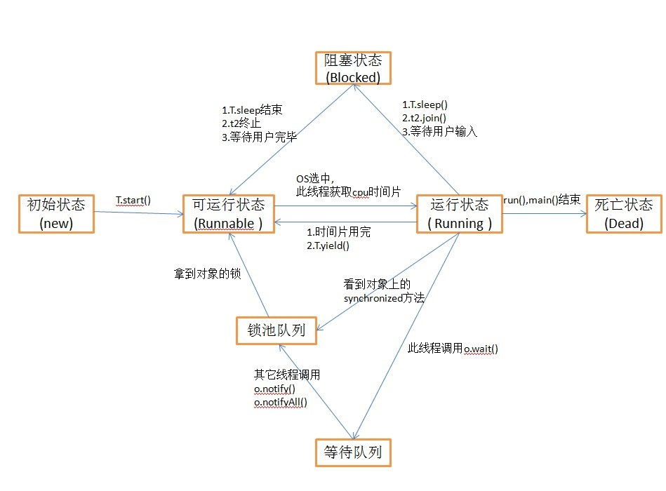

# 多线程

[TOC]

## [进程 VS 线程](https://docs.oracle.com/javase/tutorial/essential/concurrency/procthread.html)

Processes are <u>often</u> seen as synonymous(代名词) with programs or applications. 

Threads are sometimes called *lightweight processes*. Threads exist within a process — every process has at least one.

1. 线程是进程的一部分


2. CPU调度的是**线程**


3. 系统为进程分配资源，不对线程分配资源

## 为什么要有多线程？有了多线程之后，，，

因为CPU速度与内存的本身速度差异，而且一个线程可能还要处理I/O，所以为了尽可能利用CPU，需要多线程来处理

多线程即在同一时间，可以做多件事情。 多线程就相当于主线程找了个助手来做一些事，但是这些助手要和主线程争用CPU等各种资源。

**有了多线程**，因为很多操作不具有**原子性**，所以出现混乱；

所以就有了**锁**，因为有些操作要满足一定条件，所以又有了**条件对象**；因为多线程会无序地争夺锁和条件对象，就出现了**死锁和阻塞**问题，

对于死锁，java不提供一个可靠的解决方案，程序员只好仔细设计程序；

对于阻塞，可以使用锁测试和超时处理。

一方面因为涉及与 OS 的交互，构建一个新的线程是有一定代价的；另一方面是创建大量线程会大大降低性能甚至使 JVM 崩溃。所以应该使用一个线程数固定的**线程池**以限制并发线程的总数。


##启动一个线程

创建多线程有3种方式，分别是继承线程类, 实现Runnable接口,匿名类

###继承线程类

设计一个类KillThread 继承Thread，并且重写run方法 
启动线程办法： 实例化一个KillThread对象，并且调用其start方法 

###实现Runnable接口

创建类Battle，实现Runnable接口（重写run方法）

启动的时候，首先创建一个Battle对象，然后再根据该battle对象创建一个线程对象，并启动

 ```java
Battle battle1 = new Battle(gareen,teemo);

new Thread(battle1).start(); 
 ```

#### run() OR start() ?

battle1 对象实现了Runnable接口，所以有run方法，但是直接调用run方法，并不会启动一个新的线程。

必须，借助一个线程对象的start()方法，才会启动一个新的线程。

所以，在创建Thread对象的时候，把battle1作为构造方法的参数传递进去，这个线程启动start的时候，就会去执行battle1.run()方法了。

###匿名类

使用[匿名类](http://how2j.cn/k/interface-inheritance/interface-inheritance-inner-class/322.html#step687)，继承Thread,重写run方法，直接在run方法中写业务代码
匿名类的一个好处是可以很方便的访问外部的局部变量。

###总结：

分为两种：一种是继承Thread类，一种是实现Runnable接口；只不过继承Thread类，一种要单独声明一个类，一种省略了声明

启动线程是start()方法，run()并不能启动一个新的线程

因为是要**重复**地做一件事，**线程好多都是一个死循环**


## 常见线程方法

sleep(), join(), setPriority(), yield(), setDaemon()

setPriority()：在有sleep()的时候，设置优先级的效果不明显

join():  `t1.join();` t1线程加入到main线程中来，只有t1线程运行结束，**main线程**才会继续往下走；main线程和其余线程的关系

yield(): 临时暂停，暂停一段不确定的时间，不是sleep()，相当于自降优先级，效果不够明显

setDaemon(): 设置线程为守护线程， 当一个进程里，所有的线程都是守护线程的时候，结束当前进程。

## 同步

**同步格言**：如果向一个变量写入值，而这个变量接下来可能会被另一个线程读取，或者，从一个变量读值，而这个变量可能是之前被另一个线程写入的，此时必须使用同步。

多线程的同步问题指的是多个线程同时修改一个数据的时候，可能导致的问题；又叫Concurrency 问题

### synchronized 关键字

```java
final Object someObject =new Object();

synchronized (someObject){
  //此处的代码只有占有了someObject后才可以执行
}
```

### synchronized(WHAT?)

1. synchronized(**someObject**)

   所有需要修改hp的地方，都要建立在占有someObject的基础上。 

   而对象 someObject在同一时间，只能被一个线程占有。 间接地，导致同一时间，hp只能被一个线程修改。

2. synchronized(**specificObject**)

   既然任意对象都可以用来作为同步对象，而所有的线程访问的都是同一个hero对象（修改hp的**实际对象**），索性就使用gareen来作为同步对象

3. synchronized(**this**)

   进一步的，对于Hero的hurt方法（修改hp的**实际方法**），改为： 

   ```java
   public void hurt(){
     //使用this作为同步对象
     synchronized (this) {
       hp=hp-1;   
     }
   }
   ```

4. 进一步的，外部线程访问gareen的方法，就不需要额外使用synchronized 了

   ```java
   //直接在方法前加上修饰符synchronized
   //其所对应的同步对象，就是this
   //和hurt方法达到的效果一样
   public synchronized void recover(){
     hp=hp+1;
   }
   ```

注意：synchronized不是永远占有资源，而是在要执行的特定操作时占有，操作结束则释放资源

##线程安全的类

如果一个类，其方法**都是有synchronized**修饰的，那么该类就叫做线程安全的类

同一时间，只有一个线程能够进入 这种类的一个实例的去修改数据，进而保证了这个实例中的数据的安全(不会同时被多线程修改而变成脏数据)

###把非线程安全的集合转换为线程安全

```javascript
List<Integer> list1 = new ArrayList<>();
List<Integer> list2 = Collections.synchronizedList(list1);
```

##死锁


##线程的交互方式

###不好的解决方式

线程执行的过程中，使用**死循环**来判断是否执行某些操作

###wait(), notify()

wait方法和notify方法，并不是Thread线程上的方法，它们是Object上的方法。

wait()的意思是： 让占用了这个同步对象的线程，临时释放当前的占用，并且等待。 所以调用wait是有前提条件的，一定是在synchronized块里，否则就会出错。

notify() 的意思是，通知**一个** **一个** **一个** 等待在这个同步对象上的线程，你可以苏醒过来了，有机会重新占用当前对象了。

notifyAll() 的意思是，通知**所有的** **所有的** **所有的**等待在这个同步对象上的线程，你们可以苏醒过来了，有机会重新占用当前对象了。

## 线程池

每一个线程的启动和结束都是比较消耗时间和占用资源的。 

如果在系统中用到了很多的线程，大量的启动和结束动作会导致系统的性能变卡，响应变慢。 

为了解决这个问题，引入线程池这种设计思想。 

线程池的模式很像[生产者消费者模式](http://how2j.cn/k/thread/thread-wait-notify/358.html#step2591)，消费的对象是一个一个的能够运行的任务

###线程池设计思路


### 使用java自带线程池

**execute**方法用于添加新的任务

```java
ThreadPoolExecutor threadPool= new ThreadPoolExecutor(10, 15, 60, TimeUnit.SECONDS, new LinkedBlockingQueue<Runnable>());
// execute方法用于添加新的任务
threadPool.execute(new Runnable(){
  @Override
  public void run() {
    // TODO Auto-generated method stub
    System.out.println("任务1");
  }
});
```

## Lock对象

与synchronized类似的，lock也能够达到同步的效果

### 常用方法

lock(), tryLock(), tryLock(long timeout, TimeUnit unit), lockInterruptibly(), unlock(), await(), signal(), signalAll()

###Lock和synchronized的区别 **

1. Lock是一个**Java类**，而synchronized是Java中的**关键字**，synchronized是**内置**的语言实现，Lock是**代码层面**的实现。synchronized 提供对与每个对象相关联的隐式监视器锁的访问，但是**强制**所有锁获取和释放以**块结构**的方式发生：当获取多个锁时，它们必须以相反的顺序被释放，并且所有的锁都必须被释放在与它们相同的语义范围内。虽然`synchronized`方法和语句的范围机制使得使用监视器锁更容易编程，并且有助于避免涉及锁的许多常见编程错误，但是有时您需要以更灵活的方式处理锁。 所以synchronized使用简单方便，但Lock更灵活。
2. Lock可以**选择性的获取锁**，如果一段时间获取不到，可以放弃。synchronized不行，会一根筋一直获取下去。 借助Lock的这个特性，就能够规避死锁，synchronized必须通过谨慎和良好的设计，才能减少死锁的发生。
3. synchronized在发生异常和同步块结束的时候，会自动释放锁。而Lock必须**手动释放**， 所以如果忘记了释放锁，一样会造成死锁。
4. [中断响应](https://blog.csdn.net/natian306/article/details/18504111) 在使用**synchronized**时，一旦一个线程发现自己得不到锁，就一直开始等待了，就算它等死，也得不到锁；即使我们中断它`reader.interrupt();` ，它都不来响应下，看来真的要等死了。
   1. **ReentrantLock**给了一种机制让我们来响应中断，让“读”能伸能屈，勇敢放弃对这个锁的等待。`lock.lockInterruptibly();`// 注意这里，可以响应中断
   2. **ReentrantLock** 的newCondition()的 await() 和 signal() 来释放锁和唤醒线程；当然synchronized也有wait() 和notify() 
5. ReentrantLock这个类还提供了2种**竞争锁的机制**：[<u>公平锁和非公平锁</u>](https://blog.csdn.net/IsResultXaL/article/details/53334750)。这2种机制的意思从字面上也能了解个大概：即对于多线程来说，公平锁会依赖线程进来的顺序，后进来的线程后获得锁。而非公平锁的意思就是后进来的锁也可以和前边等待锁的线程同时竞争锁资源。对于效率来讲，当然是非公平锁效率更高，因为公平锁还要判断是不是线程队列的第一个才会让线程获得锁。

相同：

1. 两者都是为了同步对象，
2. 都是要先lock住对象或者synchronized住对象，才会有释放对象的singal() 和 await()操作


## 原子访问

### 概念

**原子性操作即不可中断的操作**，比如赋值操作；原子性操作本身是线程安全的 

### AtomicInteger

​	JDK6 以后，新增加了一个包java.util.concurrent.atomic，里面有各种原子类，比如AtomicInteger。

​	AtomicInteger提供了各种自增，自减等方法，这些方法都是原子性的。 换句话说，自增方法incrementAndGet 是线程安全的，同一个时间，只有一个线程可以调用这个方法。

### 缺点

能做到线程安全，但没有线程交互机制


## 问题

### 线程状态及之间的关系



### 什么是原子性，锁，条件对象，死锁，阻塞（请求锁）、等待（等待条件符合的通知），锁测试，超时，线程安全？

### 锁对象、条件对象

1. 锁对象：lock，unlock
   1. lock 拥有锁
   2. unlock 释放锁
2. 条件对象：await，singnal、singnalAll
   1. await 因某条件不满足放弃锁，并开始等待
   2. singnal、singnalAll 激活因某条件而等待的（所有）线程，相当于解除这些线程的等待，它们通过竞争重新获得锁，接下来就是对对象的访问


### 什么是迭代，包装器，

### 线程的生命周期？就是我开了很多线程，他们啥时候结束？

如果不是死循环，线程干完活就结束了呗，

join可以让他们结束，然后主线程继续执行。

### 为什么使用线程池？（使用线程池的好处）


### [多线程在单核和多核CPU上的执行效率问题的讨论](https://www.cnblogs.com/caihuafeng/p/5438753.html)

1. 多线程在 **单cpu** 中其实也是顺序执行的，不过系统可以帮你切换那个执行而已，因为线程切换需要花费时间，所以并没有快
2. 多线程的用处在于，做某个**耗时的操作**时，需要等待返回结果，这时用多线程可以提高程序并发程度。如果一个不需要任何等待并且顺序执行能够完成的任务，用多线程简直是浪费。
3. 线程必然不是越多越好，线程切换也是要开销的，<u>当你增加一个线程的时候，增加的额外开销要小于该线程能够消除的阻塞时间</u>，这才叫物有所值。
4. 多核也要用多线程才能发挥优势。同样，多线程要在多核上才能真正有优势。


## 疑惑


```
https://blog.csdn.net/caoxiaohong1005/article/details/79382600
* Note that the {@code wait} method, as it places the current thread
* into the wait set for this object, unlocks only this object; any
* other objects on which the current thread may be synchronized remain
* locked while the thread waits.
注意:由于wait方法是将当前线程放到了当前对象的wait集合里面,所以当wait方法结束时,解锁的也只是当前这个对象; // 不应该解锁线程吗？
* 当前线程用于同步的其他对象会保持线程调用wait方法时的锁状态.(关于这句话的理解,举个例子:线程如果因为m(m>1)个资源被阻塞,那么得到1个资源时,只是这个资源可以从wait状态恢复,其他的(m-1)个资源依旧是wait状态.因为当前线程的运行还需要其他(m-1)个资源,因此此时的线程还是不能够运行的.)
```