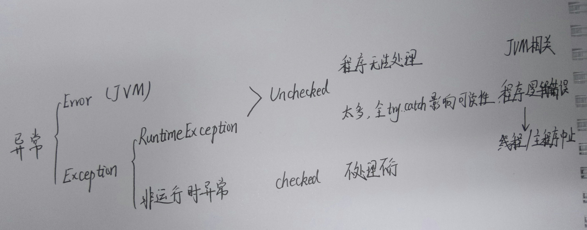
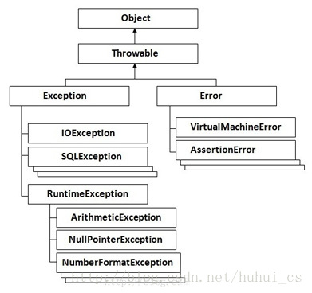

### SimpleDateFormat

日期 ---> 字符串  String s = SimpleDateFormat.format(Date);

字符串 ---> 日期  Date date = SimpleDateFormat.parse(String);

### [异常](https://blog.csdn.net/huhui_cs/article/details/38817791)

1. 分类：

   

   

   ​

2. 概念解释：

   1. 可查异常 / 非运行时异常：CheckedException

      可查异常即**必须进行处理的异常**，要么try catch住,要么往外抛，谁调用，谁处理，比如 FileNotFoundException, ParseException以及**自定义异常**
      如果不处理，编译器，就不让你通过

   2. 运行时异常：RuntimeException  不是必须进行try catch的异常 
      常见运行时异常: 

      1. 除数不能为0异常:ArithmeticException  
      2. 下标越界异常:ArrayIndexOutOfBoundsException 
      3. 空指针异常:NullPointerException 

      在编写代码的时候，依然可以使用try catch throws进行处理，与可查异常不同之处在于，即便不进行try catch，也不会有编译错误 
      Java之所以会设计运行时异常的原因之一，<u>是因为下标越界，空指针这些运行时异常**太过于普遍**，如果都需要进行捕捉，代码的可读性就会变得很糟糕。</u>

   3. 错误：系统级别的异常，通常是内存用光了
      在默认设置下，一般java程序启动的时候，最大可以使用16m的内存
      如例不停的给StringBuffer追加字符，很快就把内存使用光了。抛出OutOfMemoryError

### 自定义异常

创建异常类

新建一个方法，该方法在使用时会抛出异常

使用该方法时，捕获该异常

