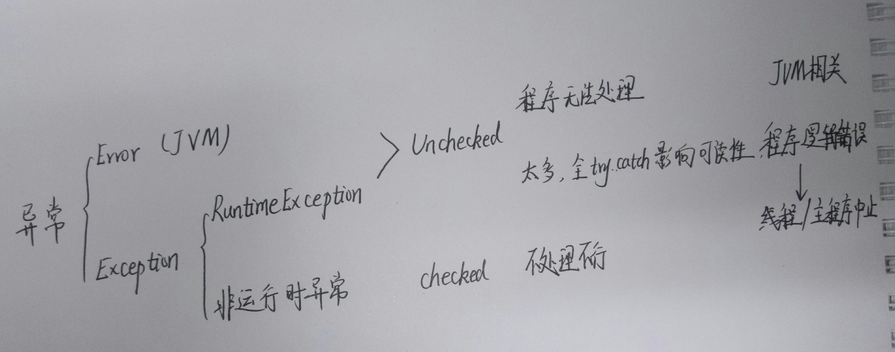
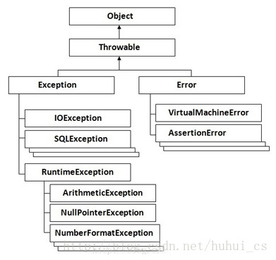

### SimpleDateFormat

//y 代表年 //M 代表月 //d 代表日 //H 代表24进制的小时 //h 代表12进制的小时 //m 代表分钟 //s 代表秒 //S 代表毫秒

```java
SimpleDateFormat sdf =new SimpleDateFormat("yyyy-MM-dd HH:mm:ss SSS" );
```

日期 ---> 字符串  String s = SimpleDateFormat.format(Date);

字符串 ---> 日期  Date date = SimpleDateFormat.parse(String);

### [异常](https://blog.csdn.net/huhui_cs/article/details/38817791)

1. 分类：

   

   

   ​

2. 概念解释：

   1. 可查异常 / 非运行时异常 / 可控异常：CheckedException

      可查异常即**必须进行处理的异常**，要么try catch住,要么往外抛，谁调用，谁处理，比如 FileNotFoundException, ParseException以及**自定义异常**
      如果不处理，编译器，就不让你通过

   2. 运行时异常：RuntimeException  不是必须进行try catch的异常 
      常见运行时异常: 

      1. 除数不能为0异常:ArithmeticException  
      2. 下标越界异常:ArrayIndexOutOfBoundsException 
      3. 空指针异常:NullPointerException 

      在编写代码的时候，依然可以使用try catch throws进行处理，与可查异常不同之处在于，即便不进行try catch，也不会有编译错误 
      Java之所以会设计运行时异常的原因之一，<u>是因为下标越界，空指针这些运行时异常**太过于普遍**，如果都需要进行捕捉，代码的可读性就会变得很糟糕。</u>

   3. 错误：是系统级别的错误，程序员是不能改变的和处理的

      在默认设置下，一般java程序启动的时候，最大可以使用16m的内存
      如例不停的给StringBuffer追加字符，很快就把内存使用光了。抛出OutOfMemoryError

二者的不同之处：

Exception：

1．可以是可被控制(checked) 或不可控制的(unchecked)。

2．表示一个由程序员导致的错误。

3．应该在应用程序级被处理。

Error：

1．总是不可控制的(unchecked)。

2．经常用来用于表示系统错误或低层资源的错误。

3．如何可能的话，应该在系统级被捕捉。

### 自定义异常

创建异常类

新建一个方法，该方法在使用时会抛出异常

使用该方法时，捕获该异常


### [为什么Java的checked exception是一个糟糕的特性](https://blog.csdn.net/kingzone_2008/article/details/8535287)

1. 由于代码中不会到处都是try-catch块，带来的代码可读性下降；Unchecked异常不会使代码显得杂乱，因为其避免了不必要的try-catch块。
2. 当被强制捕获或传播许多异常时，开发人员的效率会受到影响，也可能会对捕捉到的异常敷衍了事，仅仅`e.printStackTrace()` 
3. checked异常声明聚集使方法声明显得杂乱；Unchecked异常不会因为异常声明聚集使方法声明显得杂乱。
4. 关于容易忘记处理unchecked异常的观点在我的实践中没有发生。
5. 关于无法获知如何处理未声明异常的观点在我的实践中没有发生。
6. Unchecked异常避免了版本问题。


try...catch...finaly

```java
// 结果返回2
public static int testTry(){
  try{
    return 1;
  }
  finally {
    return 2;
  }
}
```

