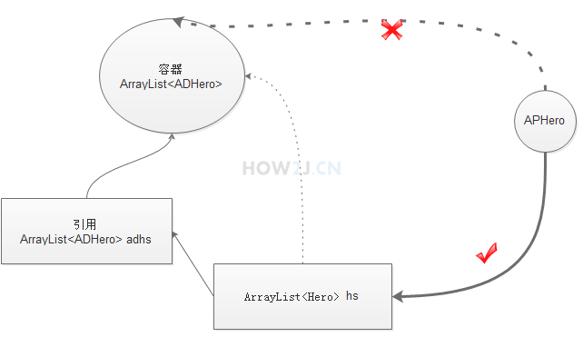

# 泛型

### 泛型的好处

泛型的用法是在容器后面添加<Type>，Type可以是类，抽象类，接口，泛型表示这种容器，只能存放Type类型的数据，别的Type就放不进去了。

#### 设计支持泛型的类

设计一个支持泛型的栈MyStack
设计这个类的时候，在类的声明上，加上一个<T>，表示该类支持泛型。
T是type的缩写，也可以使用任何其他的合法的变量，比如A,B,X都可以，但是一般约定成俗使用T，代表类型。

#### 通配符

##### ? extends T

#####？ super T

#####?

#### 泛型转型

```java
ArrayList<Hero> hs =new ArrayList<>();
ArrayList<ADHero> adhs =new ArrayList<>();
//子类泛型转父类泛型
hs = adhs;
```

#####子类泛型转父类泛型



假设可以转型成功，引用hs指向了ADHero泛型的容器，
作为Hero泛型的引用hs, 看上去是可以往里面加一个APHero的。
但是hs这个引用，实际上是指向的一个ADHero泛型的容器
如果能加进去，就变成了ADHero泛型的容器里放进了APHero，这就矛盾了

所以，子类泛型不可以转换为父类泛型

##### 父类泛型转子类泛型

假如可以转型，

`hs.add(new APhero())`

那么父类中原有的APHero怎么往ADHero转型呢？所以父类泛型也不可以转换为子类泛型


