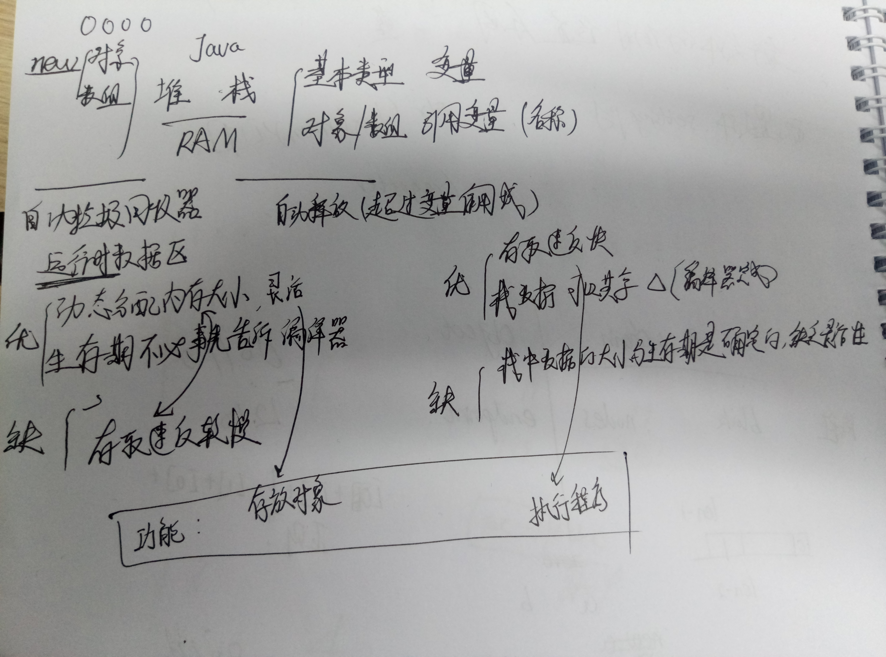

1. Java中对象的类型判断 【link】
   1. instanceof   使用该关键字不仅可以判断对象是否是某个类的实例，甚至连该类继承的基类和实现的接口也都能够被识别为true
   2. i.getClass().equals(Number.class)  不考虑继承实现的关系，当且仅当该对象是要比较的那个类的实例才返回true。
2. java中的引用类型和值类型的区别 【link】
   1. 值类型 基本数据类型 实参--传值-->形参（实参的拷贝），形参变化，实参不变
   2. 引用类型 复合数据类型 实参--传地址-->形参（仍为地址，与实参指向同一块内存），形参变化，实参也变
   3. 特殊：String String s1 = "abc"; String s2 = "abc"; s1 == s2 // True 按说引用类型的String的“==”比较的是地址，但是因为编译器做了优化，以节省 常量区 空间 Only s1 and s2 point to a different String instance(Produced by new String or new StringBuilder("").toString()). Others all point to the same one.
3. Java “==”与“equals”的区别 [[link](http://www.cnblogs.com/zhxhdean/archive/2011/03/25/1995431.html)]
   1. 基本数据类型（ 只有且仅有这八种：byte，short，char，int，long，float，double，boolean，无String ） “==”、“equals”都是比较**值**
   2. 复合数据类型(类) String是一种不允许变化的类“==”原本比较的是**内存中的存放地址，** JAVA当中所有的类都是继承于Object这个基类的，在Object中的基类中定义了一个equals的方法，这个方法的初始行为是比较对象的内存地 址，但在一些类库当中这个方法被覆盖掉了，如String,Integer,Date在这些类当中equals有其自身的实现，而不再是比较类在堆内存中的存放地址了。“equals”比较值
   3. null == null  TRUE
   4. "=="符号在比较对象的时候是比较的内存地址，而对于原始数据类型是直接比对的数据值。
4. System.out.println(Object) 与 toString() 的关系 【[link](https://stackoverflow.com/questions/29318996/the-connection-between-system-out-println-and-tostring-in-java)】
   1. println -> String.valueof(obj) -> obj == null ? "null" : obj.toString()  -> getClass().getName() + '@' + Integer.toHexString(hashCode())
   2. So, when you call `System.out.println()` on an object that doesn't define its own version of toString(), you might get the `Object` version which looks like "classname@someHexNumber".
   3. 重写toString()之后，println() 打印出的就是toString()的内容
5. Integer类型比较大小
   1. Integer i = new Integer(-130);
      Integer c = new Integer(-130);
      System.out.println( i == c);  // false
      System.out.println( i.intValue() == c.intValue()); //true
      System.out.println( i.equals(c)); //true
   2. 原因【[link](http://www.blogjava.net/zhangyuan/archive/2010/07/24/327011.html)】另：i，c是在堆中两个不同的对象，对于对象，“==”比较的是两个地址，所以i==c 为false
   3. cast an Object to an int     `int intValue = (int)object`
   4. Integer 转 int `Integer.intValue()```
6. array VS ArrayList [link]
   1. array 是静态的 是**本地**的程序设计组件或者数据结构，创建语句 int[] array = new int[100];
   2. ArrayList是动态的 是一个来自Java集合类的类  创建语句 List<Integer> list = new ArrayList<>();
7. ArrayList
   1. ​    add()
8. String VS StringBuilder
   1. String 是静态的，但是可以重新赋值啊，如果要拼接字符串只好用StringBuilder
   2. StringBuilder append(String)  老麻烦的，应尽量避免
9. String 字符串分割【[link](https://blog.csdn.net/kunlong0909/article/details/8507290)】
10. collection
11. Java 集合--Map、HashMap、HashTable、TreeMap【[link](http://zzqrj.iteye.com/blog/841782)】
    1. ​
       - Iterator keyValuePairs = aMap.entrySet().iterator();  
       - Iterator keys = aMap.keySet().iterator();//keys.remove();删除当前键值对  
       - Iterator values = aMap.values().iterator();//values.remove();删除当前键值对  
    2. HashMap 的遍历：获取entrySet(), Keyset()的迭代器  对应的就是使用简洁的for-each循环
    3. put, get（若没有该key, 则为null）, replace, containsKey
12. HashMap 工作原理 【[link](https://yikun.github.io/2015/04/01/Java-HashMap%E5%B7%A5%E4%BD%9C%E5%8E%9F%E7%90%86%E5%8F%8A%E5%AE%9E%E7%8E%B0/)】
    1. HashMap在每个节点中储存**键值对对象 **Map.Entry
    2. hashing实现 (h = k.hashCode()) ^ (h >>> 16)
    3. 
13. Java 8 中的 Streams API 详解 [[link](https://www.ibm.com/developerworks/cn/java/j-lo-java8streamapi/)] -+
14. Java8：不要再用循环了 [link] <--------|
    1. 更少的代码行数
    2. 更好的代码阅读性
    3. 只将缩进用于管理代码文本
    4. mybatis不写sql，stream使得不写for
15. static 静态的 【link】
    1. 静态变量/方法，由类的所有实例共享
    2. **不需实例化**即可访问
16. final 最终的【link】
    1. 变量不可变，方法不可覆盖，类不可继承
    2. final static 全局常量
17. Item 泛型，实例化的时候让其为何种类型就是何种类型
18. java native方法及JNI实例 [[link](https://blog.csdn.net/xw13106209/article/details/6989415)]  被native修饰的方法不是由java实现的，是依赖系统底层的
19. transient 【[link](http://www.cnblogs.com/lanxuezaipiao/p/3369962.html)】 被transient修饰的变量不能被序列化
20. can't change JDK to X [[link](https://intellij-support.jetbrains.com/hc/en-us/community/posts/207133555-Can-t-change-JDK-to-7)]
21. 本地部署SSM：
    1. import gradle
    2. mybatisGenerate
    3. 修改jdbc.properties
    4. 配置Tomcat
    5. 访问/swagger-ui.html****

****

****

- Idea 快捷键

  ​

- Servlet

  1. <https://www.ibm.com/developerworks/cn/education/java/j-intserv/j-intserv.html>
  2. <https://www.ibm.com/developerworks/cn/java/j-lo-servlet/>

- Tomcat

  1. <https://juejin.im/post/58eb5fdda0bb9f00692a78fc>
  2. <https://www.ibm.com/developerworks/cn/java/j-lo-tomcat1/index.html>
  3. <http://wiki.jikexueyuan.com/project/java-web/00-08.html>
  4. <http://wiki.jikexueyuan.com/project/tomcat/introduction.html>
  5. Tomcat 源码解读 【[link](http://www.cnblogs.com/levinzhang/archive/2012/08/25/2655617.html)】

- 什么是JavaBean、bean? 什么是POJO、PO、DTO、VO、BO ? 什么是EJB、EntityBean？【link】

  1. Java Bean 
     1. 所有属性为private
     2. 提供默认构造方法
     3. 提供getter和setter
     4. 实现serializable接口: 用于实现 Bean 的持久性
  2. Bean
     1. Bean的含义是可重复使用的Java组件。所谓**组件**就是一个由可以自行进行内部管理的一个或几个类所组成、外界不了解其内部信息和运行方式的群体。使用它的对象只能通过接口来操作。
  3. POJO
     1. 全称是Plain Ordinary Java Object / Pure Old Java Object，中文可以翻译成：普通Java类
     2. 是一个不受任何限制的Java对象（除了Java语言规范）。例如一个POJO不应该是
        1. 1. 扩展预定的类，如       public class Foo extends javax.servlet.http.HttpServlet { ...
           2. 实现预定的接口，如   public class Bar implements javax.ejb.EntityBean { ...
           3. 包含预定的标注，如   @javax.ejb.Entity public class Baz{ ...
     3. 一般在web应用程序中建立一个**数据库的映射对象**时，我们只能称它为POJO。
  4. EntityBeans（EJB规范中专门用于封装数据库访问的一种组件，以面向对象的方式进行数据库的访问）。
  5. DTO （TO） ：Data Transfer Object 数据传输对象。
  6. DAO ：data access object 数据访问对象。

- 【Java面向对象学习】一张图搞定Java面向对象 [link]

  ​

  1. |      | 局部变量 | 成员变量 | 静态变量 |
     | ---- | ---- | ---- | ---- |
     | 内存位置 | 栈    | 堆    | 堆    |
     | 生命周期 | 方法   | 对象   | 类    |

  2. 那张图还不是了解

- Java 内存机制 【[link](http://www.cnblogs.com/IT-Monkey/p/3640596.html)】




1. ```java
   private static int[] Create_Array(int len){
       // array放在堆中 在 java 里,由于是进行引用传递,他会在每一次对象赋值的时候进行引用计数,
       // 如果计数不为0,就不会回收局部变量,那么也就不会造成消失的问题 也就是当没有引用指向它的时候，
       // 垃圾收集器会在适当的时候 把他清除。以上就是JAVA运行机制中的一部分（垃圾收集）
       int[] array = new int[len];

       // 生成随机数
       for(int i = 0; i < len; i ++){
           array[i] = (int)(Math.random() * 100);
       }
       return array;
   }
   ```

2. 编译 javac test.java  运行 java test

3. pre 前 post 后

4. if(condition1 &&/|| condition2) 先判断1，再判断2

5. 类 String 对象 String **s** 实例 String **s** = "abc";