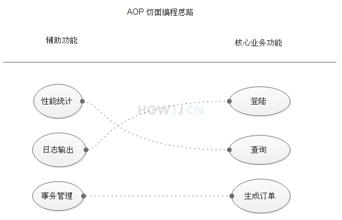

[TOC]

#IoC/DI

## [概念解释](https://blog.csdn.net/qq_22654611/article/details/52606960/)

###IoC 控制反转

**Ioc—Inversion of Control，即“控制反转”，不是什么技术，而是一种设计思想。**在Java开发中，**Ioc意味着将你设计好的对象交给容器控制，而不是传统的在你的对象内部直接控制。**

谁控制谁？当然是IoC 容器控制了对象；控制什么？那就是主要控制了外部资源获取（不只是对象包括比如文件等）。

为何是反转？因为由容器帮我们查找及注入依赖对象，对象只是被动的接受依赖对象，所以是反转；哪些方面反转了？依赖对象的获取被反转了。

### DI 依赖注入

IoC的一个重点是在系统运行中，动态的向某个对象提供它所需要的其他对象。这一点是通过DI（Dependency Injection，依赖注入）来实现的。

**DI—Dependency Injection，即“依赖注入”**：**组件之间依赖关系**由容器在运行期决定，形象的说，即**由容器动态的将某个依赖关系注入到组件之中**。**依赖注入的目的并非为软件系统带来更多功能，而是为了提升组件重用的频率，并为系统搭建一个灵活、可扩展的平台。**

● 谁依赖于谁：当然是**应用程序依赖于IoC容器**；

● 为什么需要依赖：**应用程序需要IoC容器来提供对象需要的外部资源**；

● 谁注入谁：很明显是**IoC容器注入应用程序某个对象，应用程序依赖的对象**；

● 注入了什么：就是**注入某个对象所需要的外部资源（包括对象、资源、常量数据）**。

### IoC和DI 两者关系

**IoC和DI**由什么**关系**呢？其实它们**是同一个概念的不同角度描述**，“依赖注入”，相对IoC 而言，“依赖注入”明确描述了“被注入对象依赖IoC容器配置依赖对象”。

## 在Spring上的实践

Spring是一个基于IoC和AOP的结构J2EE系统的框架 

IoC 反转控制 是Spring的基础，Inversion Of Control ，**IoC，对于spring框架来说，就是由spring来负责控制对象的生命周期和对象间的关系。**

**Spring所倡导的开发方式**就是如此，**所有的类都会在spring容器中登记，告诉spring你是个什么东西，你需要什么东西，然后spring会在系统运行到适当的时候，把你要的东西主动给你，同时也把你交给其他需要你的东西。所有的类的创建、销毁都由 spring来控制，也就是说控制对象生存周期的不再是引用它的对象，而是spring。对于某个具体的对象而言，以前是它控制其他对象，现在是所有对象都被spring控制，所以这叫控制反转。**

简单说就是创建对象由以前的程序员自己new 构造方法来调用，变成了交由Spring创建对象 

DI 依赖注入 Dependency Inject. 简单地说就是拿到的对象的属性，已经被注入好相关值了，直接使用即可。至于Spring是如何创建那个对象，以及什么时候创建好对象的，当前对象不需要关心这些细节问题。

##注入属性和对象

主要是引入jar包，配置applicationContext.xml，然后通过spring获取Category对象，以及该对象被注入的name属性。

```java
public class TestSpring {
  public static void main(String[] args) {
    ApplicationContext context = new ClassPathXmlApplicationContext(
      new String[] { "applicationContext.xml" });

    Product p = (Product)context.getBean("p");
    System.out.println(p.getName());
    System.out.println(p.getCategory().getName());
  }
}
```

## [什么是Bean？](https://blog.csdn.net/chenssy/article/details/8222744)

从前面我们知道Spring其实就是一个大型的工厂，而Spring容器中的Bean就是该工厂的产品.对于Spring容器能够生产那些产品，则取决于配置文件中配置。

```xml
<bean name="c" class="com.how2java.pojo.Category">
	<property name="name" value="category 1" />
</bean>
```

<beans…/>元素是Spring配置文件的根元素，<bean…/>元素是<beans../>元素的子元素，<beans…/>元素可以包含多个<bean…/>子元素，每个<bean…/>元素可以定义一个Bean实例，**每一个Bean对应Spring容器里的一个Java实例**

容器中Bean的作用域:

Singleton：单例模式。在整个SpringIoC容器中，使用singleton定义的Bean将只有一个实例。

Prototype：原型模式。每次通过容器的getBean方法获取prototype定义的Bean时，都将产生一个新的Bean实例。（Java在创建Java实例时，需要进行内存申请。销毁实例时，需要完成垃圾回收。这些工作都会导致系统开销的增加。因此，prototype作用域Bean的创建、销毁代价会比较大。）

request：对于每次HTTP请求，使用request定义的Bean都将产生一个新的实例，即每次HTTP请求都会产生不同的Bean实例。当然只有在WEB应用中使用Spring时，该作用域才真正有效。

session：对于每次HTTPSession，使用session定义的Bean都将产生一个新的实例时，即每次HTTP Session都将产生不同的Bean实例。同HTTP一样，只有在WEB应用才会有效。

global session：每个全局的HTTPSession对应一个Bean实例。仅在portlet Context的时候才有效。

## 注解方式IoC/DI

###对注入对象的行为的注解

####@Autowired

1. 在Product.java的category**属性**前加上@Autowired注解
2. 在setCategory**方法**前加上@Autowired，这样来达到相同的效果

#### @Resource

除了@Autowired之外，@Resource也是常用的手段

### 对Bean的注解

上述例子是对注入对象行为的注解，那么bean对象本身，比如Category,Product可不可以移出applicationContext.xml 配置文件，也通过注解进行呢？

####@Component

为Product类加上@Component注解，即表明此类是bean

另外，因为配置从applicationContext.xml中移出来了，所以**属性初始化**放在属性声明上进行了。

# AOP

AOP 即 Aspect Oriented Program 面向切面编程 
首先，在面向切面编程的思想里面，把功能分为核心业务功能，和周边功能。 
​	所谓的核心业务，比如登陆，增加数据，删除数据都叫核心业务 
​	所谓的周边功能，比如性能统计，日志，事务管理等等 

周边功能在Spring的面向切面编程AOP思想里，即被定义为切面 

在面向切面编程AOP的思想里面，核心业务功能和切面功能分别独立进行开发 
然后把切面功能和核心业务功能 "编织" 在一起，这就叫AOP

## AOP的一些相关概念

- 切面（Aspect）：是切入点和通知的结合；
- 连接点（Joinpoint）：类里面可以被增强的方法，这些方法称为连接点；
- 增强处理（Advice）：指拦截到Joinpoint之后所要做的事情就是通知.通知分为前置通知,后置通知,异常通知,最终通知,环绕通知(切面要完成的功能)；
- 切入点（Pointcut）：指我们要对哪些Joinpoint进行拦截的定义。

## 思路图

1. 功能分两大类，辅助功能和核心业务功能
2. 辅助功能和核心业务功能彼此独立进行开发
3. 比如登陆功能，即便是没有性能统计和日志输出，也可以正常运行
4. 如果有需要，就把"日志输出" 功能和 "登陆" 功能 编织在一起，这样登陆的时候，就可以看到日志输出了
5. 辅助功能，又叫做切面，这种能够选择性的，低耦合的把切面和核心业务功能结合在一起的编程思想，就叫做切面编程



## AOP增强处理方法

Before  用于目标方法被调用前做一些增强处理。

AfterReturning  用于访问目标方法返回值，并作相关处理。

After  用于目标方法被调用后做一些增强处理。与AfterReturning有些相似，但是也有区别，AfterReturning只有在目标方法成功完成后才会被织入。

Around  ProceedingJoinPoint 参数是必须的，因为要使的目标方法要调用，那么必须调用其方法proceed()。

AfterThrowing  用于处理目标方法抛出的异常。

## 日志输出功能的AOP实现

1. 业务类

2. 准备日志切面

   ```java
   public class LoggerAspect {
     public Object log(ProceedingJoinPoint joinPoint) throws Throwable {
       System.out.println("start log:" + joinPoint.getSignature().getName());
       Object object = joinPoint.proceed();
       System.out.println("end log:" + joinPoint.getSignature().getName());
       return object;
     }
   }
   ```

3. applicationContext.xml 配置

   - AspectJ语法

     `"execution(* cn.youyinian.controller.v1.*.*(..))"`

     - 指定在执行 cn.youyinian.controller.v1 包中任意类的任意方法之前执行方法增强；
     - 第一个星号表示返回值不限；
     - 第二个星号表示类名不限；
     - 第三个星号表示方法名不限；
     - 圆括号中的 .. 表示任意个数、类型不限的形参。

   ```xml
   <!--声明业务对象-->
   <context:component-scan base-package="com.how2java.service"/>
   <!--声明日志切面-->
   <bean id="loggerAspect" class="com.how2java.aspect.LoggerAspect"/>

   <!--通过aop:config把业务对象与辅助功能编织在一起-->
   <aop:config>
     <!--指定右边的核心业务功能-->
     <aop:pointcut id="loggerCutpoint"
                   expression= "execution(* com.how2java.service.ProductService.*(..)) "/>
     <!--指定左边的辅助功能-->
     <aop:aspect id="logAspect" ref="loggerAspect">
       <aop:around pointcut-ref="loggerCutpoint" method="log"/>
     </aop:aspect>
   </aop:config>
   ```

4. 再以IoC方式调用业务类的方法，该方法与日志切面一同执行

## 注解方式AOP

主要是把日志切面类修改为：

```java
/**
 * LoggerAspect 是一个bean(@Component)，但也是一个切面（@Aspect）
 * */
@Aspect
@Component
public class LoggerAspect {

    /*表示对com.how2java.service.ProductService 这个类中的所有方法进行切面操作*/
    @Around(value = "execution(* com.how2java.service.ProductService.*(..))")
    public Object log(ProceedingJoinPoint joinPoint) throws Throwable {
        System.out.println("start log:" + joinPoint.getSignature().getName());
        Object object = joinPoint.proceed();
        System.out.println("end log:" + joinPoint.getSignature().getName());
        return object;
    }
}
```

### 对注解的感受

使用注解更为简洁

相比与直接读取applicationContext.xml进行设置属性，java编译器肯定多做了一些工作来解析，比如要从base-package中找到被注解的类，方法

## Spring注解方式测试

```java
@RunWith(SpringJUnit4ClassRunner.class) // 表示这是一个Spring的测试类
@ContextConfiguration("classpath:applicationContext.xml") // 定位Spring的配置文件
public class TestSpring {
  @Autowired // 给这个测试类装配Category对象
  Category c;

  @Test // 测试逻辑，打印c对象的名称
  public void test(){
    System.out.println(c.getName());
  }
}
```

