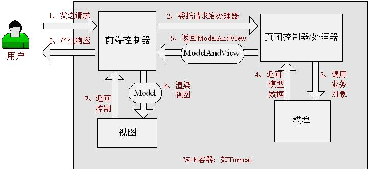
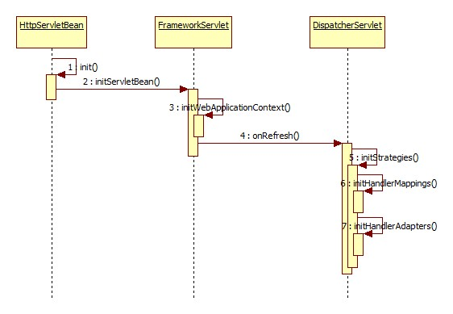

http://jinnianshilongnian.iteye.com/blog/1594806

Spring Web MVC是一种基于Java的实现了Web MVC设计模式的请求驱动类型的轻量级Web框架，即使用了MVC架构模式的思想，将web层进行职责解耦，**基于请求驱动**指的就是使用请求-响应模型，框架的目的就是帮助我们简化开发，Spring Web MVC也是要**简化我们日常Web开发**的。

## Spring Web MVC架构

### Spring Web MVC处理请求的流程

具体执行步骤如下：

1、  首先用户发送请求————>前端控制器，前端控制器根据请求信息（如URL）来决定选择哪一个页面控制器进行处理并把请求委托给它，即以前的控制器的控制逻辑部分；图2-1中的1、2步骤；

2、  页面控制器接收到请求后，进行功能处理，首先需要收集和绑定请求参数到一个对象，这个对象在Spring Web MVC中叫命令对象，并进行验证，然后将命令对象委托给业务对象进行处理；处理完毕后返回一个ModelAndView（模型数据和逻辑视图名）；图2-1中的3、4、5步骤；

3、  前端控制器收回控制权，然后根据返回的逻辑视图名，选择相应的视图进行渲染，并把模型数据传入以便视图渲染；图2-1中的步骤6、7；

4、  前端控制器再次收回控制权，将响应返回给用户，图2-1中的步骤8；至此整个结束。

### Spring Web MVC架构

核心架构的具体流程步骤如下：

1、  首先用户发送请求——>DispatcherServlet，前端控制器收到请求后自己不进行处理，而是委托给其他的解析器进行处理，作为统一访问点，进行全局的流程控制；

2、  DispatcherServlet——>HandlerMapping， HandlerMapping将会把请求映射为HandlerExecutionChain对象（包含一个Handler处理器（页面控制器）对象、多个HandlerInterceptor拦截器）对象，通过这种策略模式，很容易添加新的映射策略；

3、  DispatcherServlet——>HandlerAdapter，HandlerAdapter将会把处理器包装为适配器，从而支持多种类型的处理器，即适配器设计模式的应用，从而很容易支持很多类型的处理器；

4、  HandlerAdapter——>处理器功能处理方法的调用，HandlerAdapter将会根据适配的结果调用真正的处理器的功能处理方法，完成功能处理；并返回一个ModelAndView对象（包含模型数据、逻辑视图名）；

5、  ModelAndView的逻辑视图名——> ViewResolver是视图解析器， ViewResolver将把逻辑视图名解析为具体的View，通过这种策略模式，很容易更换其他视图技术；

6、  View——>渲染，View会根据传进来的Model模型数据进行渲染，此处的Model实际是一个Map数据结构，因此很容易支持其他视图技术；

7、返回控制权给DispatcherServlet，由DispatcherServlet返回响应给用户，到此一个流程结束。

 

此处我们只是讲了核心流程，没有考虑拦截器、本地解析、文件上传解析等，后边再细述。

1、  请求如何给前端控制器？这个应该在web.xml中进行部署描述，在HelloWorld中详细讲解。

2、  前端控制器如何根据请求信息选择页面控制器进行功能处理？ 我们需要配置HandlerMapping进行映射

3、  如何支持多种页面控制器呢？配置HandlerAdapter从而支持多种类型的页面控制器

4、  如何页面控制器如何使用业务对象？可以预料到，肯定利用Spring IoC容器的依赖注入功能

5、  页面控制器如何返回模型数据？使用ModelAndView返回

6、  前端控制器如何根据页面控制器返回的逻辑视图名选择具体的视图进行渲染？ 使用ViewResolver进行解析

7、  不同的视图技术如何使用相应的模型数据？ 因为Model是一个Map数据结构，很容易支持其他视图技术

在此我们可以看出具体的核心开发步骤：

1、  DispatcherServlet在web.xml中的部署描述，从而拦截请求到Spring Web MVC

2、  HandlerMapping的配置，从而将请求映射到处理器

3、  HandlerAdapter的配置，从而支持多种类型的处理器

4、  ViewResolver的配置，从而将逻辑视图名解析为具体视图技术

5、 处理器（页面控制器）的配置，从而进行功能处理

 

## SpringMVC 初始化过程

https://blog.csdn.net/shi1122/article/details/7961351

http://objcoding.com/2017/06/14/SpringMVC-initialization-process/

