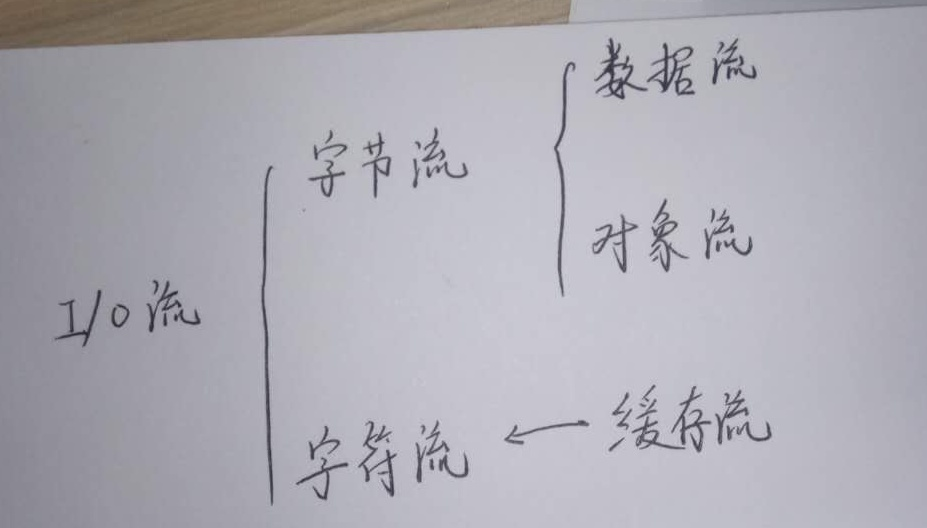

### 文件对象

File file = new File(pathName);

常用方法：exist(), isFile(), isDirectory(), getAbsolutePath(), getName(), listFiles()

### 字节流

FileInputStream 和 FileOutputStream 依靠**字节数组 byte[]**进行将文件写入磁盘和从磁盘读取文件

```java
try{
  File f = new File(pathName);
  // 利用字符数组读取、写入文件内容，其长度就是文件的长度
  byte[] all = new byte[len];
  // 从磁盘读取
  FileInputStream fis = new FileInputStream(f);
  fis.read(all, offset, length);
  fis.close();
  // 往磁盘写入
  FileOutputStream fos = new FileOutputStream(f);
  fos.write(all, offset, length);
  fos.close();    
}
catch(Exception e){
    e.printStackTrace();
}
```

### [关闭流](http://how2j.cn/k/io/io-closestream/682.html#nowhere)

1. 在try中关闭

   上节提到的在try中关闭流的方式有一个弊端，如果文件不存在，或者读取的时候出现问题而抛出异常，那么就不会执行这一行关闭流的代码，存在巨大的资源占用隐患。

2. 在finally中关闭

   严谨、繁琐

3. 使用try()的方式 **Recommend**

   把流定义在try()里,try,catch或者finally结束的时候，会自动关闭；这种编写代码的方式叫做 **try-with-resources**， 这是从JDK7开始支持的技术

   所有的流，都实现了一个接口叫做 **AutoCloseable**，任何类实现了这个接口，都可以在try()中进行实例化。 并且在try, catch, finally结束的时候自动关闭，回收相关资源。

### 字符流

FileWriter 和 FileReader 依靠**字符数组char[]**进行将文件写入磁盘和从磁盘读取文件

```java
/*
* 把encodingFile的内容进行加密，然后保存到encodedFile文件中。
*/
private  static void encodeFile(File encodingFile, File encodedFile){
  int len = (int)encodingFile.length();
  char[] chars = new char[len];
  // 读
  try(FileReader fileReader = new FileReader(encodingFile)){
    fileReader.read(chars);
  }
  catch (IOException e){
    e.printStackTrace();
  }
  // 写
  try(FileWriter fileWriter = new FileWriter(encodedFile)){
    fileWriter.write(chars);
  }
  catch (IOException e){
    e.printStackTrace();
  }
}
```

### 中文编码

1. 用FileInputStream **字节流**正确读取中文

   在将文件内容读入 byte[] 后，通过String str = new String(byte[], "charsetName") 来转换编码格式，之后输出

2. 用FileReader **字符流**正确读取中文

   1. 使用 FileReader <u>默认</u>的编码方式

      将文件内容读入 char[] 中，通过String str = new String(char[]) ，之后输出识别出来的字符

   2. FileReader是不能手动设置编码方式的，为了使用其他的编码方式，只能使用InputStreamReader来代替

      InputStreamReader isr = new InputStreamReader(new FileInputStream(f),Charset.forName("UTF-8"))

      之后，将文件内容读入char[] ，然后通过String str = new String(char[]) ，之后输出识别出来的字符

3. ```java
   //byte[] --> String    字节表示的内容转字符串  
   String str = new String(byte[], charsetName);
   // String --> byte[]   获取字符串的某种编码方式的字节表示 
   byte[] bytes = str.getBytes(charsetName);
   // 字节的16进制表示
   for(byte b: bytes){
       sout(Integer.toHexString(int(b & 0xFF)) + "\t");
   }
   ```


### 缓存流

字节流和字符流的弊端： 在每一次读写的时候，都会**访问硬盘**。 如果读写的频率比较高的时候，其性能表现不佳。 

为了解决以上弊端，采用缓存流。 缓存流在读取的时候，会一次性读较多的数据到缓存中，以后每一次的读取，都是在缓存中访问，直到缓存中的数据读取完毕，再到硬盘中读取。 写入数据时同样经过缓存。

BufferedReader  PrintWriter

### 数据流

DataInputStream 数据输入流 DataOutputStream 数据输出流

可以进行数据的格式化顺序读写

### 对象流

ObjectOutputStream    ObjectInputStream

一个对象以流的形式进行传输，叫做序列化。该对象所对应的类，必须是**实现Serializable接口**

**缓存流，数据流和对象流都必须<u>建立在一个存在的流的基础上</u>**


