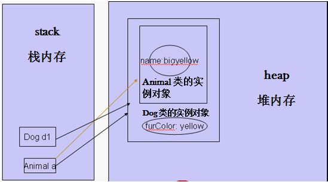

### [对象转型](http://www.cnblogs.com/xdp-gacl/p/3647810.html)

1. 向上转型：**父类对象的引用或者叫基类对象的引用指向子类对象，这就是向上转型** ，也就是子类转换为父类，这是说得通的

2. 向下转型：**父类对象引用father转换成子类类型**的时候，就有可能成功，有可能失败；因此要进行强制转换，换句话说转换后果自负；到底能不能转换成功，要看**father引用到底指向的是哪种对象** 

3. **父类(基类)对象的引用不可以访问其子类对象新增加的成员(属性和方法)。**对象继承的编译器表现：Animal ----> Dog，Animal a = new Dog(); 因为子类Dog从父类Animal继承下来，所以new出一个子类对象的时候，这个子类对象里面会包含有一个父类对象， 因此这个a指向的正是这个子类对象里面的父类对象，因此尽管a是指向Dog类对象的一个引用， 但是在**编译器**眼里你a就是只是一个Animal类的引用对象，你a就是只能**访问**Animal类里面所具有的成员变量，别的你都访问不了。<u>*因此一个父类(基类)对象的引用是不可以访问其子类对象新增加的成员(属性和方法)的。*</u>  

4. 如果真的想访问Dog对象的furColor属性，那就采用**对象向下转型**的办法，把父类对象的引用转型成子类对象的引用。Dog d1 = (Dog)a; （在这个例子里，a指向的是一个Dog对象，所以转换成Dog类型，是可以的），这样d1和a都是指向堆内存里面的Dog对象了，而且d1指向的就是这只Dog**所有的部分**，通过这个d1就可以访问Dog对象里面所有的成员了。

   

   ​

5. instanceof 探索的是实际当中你整个对象到底是什么东西，并不是根据你的引用把对象看出什么样来判断的。

   ```java
   Animal animal = new Dog();
   // animal 是Animal的子类，所以为true
   animal instanceof Animal // true 
   animal instanceof Dog // true 
   ```

6. **对象的向上转型可以使父类对象的引用可以指向子类对象，给程序带来了比较好的可扩展性：我们可以在一个方法的参数里面定义父类的引用，然后实际当中传的时候传的是子类的对象，然后我们再在方法里面判断这个传过来的子类对象到底属于哪个子类，然后再去执行这个子类里面的方法或者调用这个子类里面的成员变量，因此程序的可扩展性比单独定义好多个方法要好一些。**不过这个可扩展性还没有达到最好，使用多态就可以让程序的扩展性达到极致。

   ```java
   public void  f(Animal a) { // 参数可为子类，向上转型
       System.out.println(a.name);
       if (a instanceof Cat) {
           Cat cat = (Cat)a; // 安全的向下转型
           System.out.println(cat.eyeColor+" eye");
       }else if (a instanceof Dog) {
           Dog dog = (Dog)a;
           System.out.println(dog.furColor+" fur");
       }
   }
   ```

7. <u>实现类</u>转换成<u>接口</u>(向上转型)

   ```java
   // ADHero实现了AD接口
   ADHero ad = new ADHero();
   // AD是接口类型
   AD adi = ad; // 是可以的
   ```

8. <u>接口</u>转换成<u>实现类</u>(向下转型)

   ```java
   // ADHero实现了AD接口
   ADHero ad = new ADHero();
   // AD是接口类型  向上转型是可以的
   AD adi = ad;
   // 向下转型，要看adi引用指向的是何种对象，此处指向的是ADHero对象，要转换成ADHero，所以可以
   ADHero adHero = (ADHero) adi;
   // 要把指向ADHero的引用adi指向ADAPHero就是失败的
   ADAPHero adapHero = (ADAPHero) adi;
   ```

### 重写

​	子类可以继承父类的对象方法；在继承后，重复提供该方法，就叫做方法的重写；又叫覆盖 override

### 隐藏

​	与重写类似，方法的重写是子类覆盖父类的对象方法 ；隐藏，就是子类覆盖父类的**类方法** （类中static修饰的方法）

### 多态

​	都是同一个类型（都是父类类型，实际上指向的是不同的对象），调用同一个方法（该方法有重写），却能呈现不同的状态

### Super

实例化一个ADHero(), 其构造方法会被调用；其父类的构造方法也会被调用 ；并且是父类构造方法先调用；子类构造方法会默认调用父类的无参的构造方法

使用关键字super 显式调用父类带参的构造方法

父类Hero提供了一个有参的构造方法，但是没有提供无参的构造方法，子类应该怎么处理？

- 子类必须显式调用父类的带参构造函数，不然会默认调用父类的无参构造函数，而父类又没有（因为已经显式声明了带参构造函数，且没有显式声明无参构造函数，无参构造函数就不存在了），就会报错

### Object

1. Object类是所有类的父类
2. toString()。Object类提供一个toString方法，所以所有的类都有toString方法；toString()的意思是返回当前对象的字符串表达；通过 System.out.println 打印对象就是打印该对象的toString()返回值
3. finalize()。当一个对象没有任何引用指向的时候，它就满足垃圾回收的条件，当垃圾堆积的**比较多** （如果你发现没有被回收，就是堆积的不够多）的时候，就会触发**垃圾回收**；当它被垃圾回收的时候，它的finalize() 方法就会被调用。finalize() 不是开发人员主动调用的方法，而是由**虚拟机JVM调用**的。
4. equals()  用于判断两个对象的内容是否相同；但是很多对象会重写equals，其作用就不确定了。
5. == 这不是Object的方法，但是用于判断两个对象是否相同；更准确的讲，用于判断两个引用，是否指向了同一个对象
6. **hashCode()** 返回一个对象的哈希值
7. 线程同步相关方法
8. getClass()

### 抽象类

1. 在类中声明一个方法，**这个方法没有实现体**，是一个“**空**”方法；这样的方法就叫抽象方法，使用修饰符“abstract" ，当一个类有抽象方法的时候，该类必须被声明为抽象类
2. 可以在不提供抽象方法的前提下，声明为抽象类 
3. 一旦一个类被声明为抽象类，就不能够被直接实例化
4. [抽象类 VS 接口 ](http://www.importnew.com/12399.html)
   1. 子类只能**继承**一个抽象类，不能继承多个
      子类可以**实现**多个接口

   2. 抽象类可以定义
      **public, protected, package, private**
      **静态和非静态属性**
      **final和非final属性**
      但是接口中声明的属性，只能是
      **public static final 的**
      即便没有显示的声明

   3. 如果你拥有一些方法并且想让它们中的一些有默认实现，那么使用抽象类吧。（JDK1.8之后，接口有了默认方法，也可以默认实现一些功能）

      如果你想实现**多重继承**，那么你必须使用接口。由于**Java不支持多继承**，子类不能够继承多个类，但可以实现多个接口。因此你就可以使用接口来解决它。

      如果**基本功能在不断改变**，那么就需要使用抽象类。如果不断改变基本功能并且使用接口，那么就需要改变所有实现了该接口的类。

### 内部类

1. 非静态内部类（**对象级**）  实例必须绑定在外部对象的实例上；so, 可以直接访问外部类的实例属性

   ​	应用：有些实例**依赖**另一个实例存在

2. 静态内部类（**类级**） 可看做是外部类的static成员，它的对象与外部类对象之间不存在依赖关系，相互**独立**，所以可以直接创建；因为没有一个外部类的实例，所以在静态内部类里面不可以访问外部类的实例属性和方法；除了可以访问外部类的私有静态成员外，静态内部类和普通类没什么大的区别代码比较复制代码

   ​	应用：利用静态内部类实现线程安全的单例模式的饿汉式

3. 匿名类  有的时候，为了快速使用，直接实例化一个抽象类（使代码更加简洁精练），并“当场”实现其抽象方法。既然实现了抽象方法，那么就是一个新的类，只是这个类，**没有命名**。

   ​	应用：**实例化一个抽象类**

4. 本地类  本地类可以理解为有名字的匿名类 

5. 声明位置：

   1. 内部类必须声明在**成员**的位置，即与属性和方法平等的位置。 
   2. 本地类和匿名类一样，直接声明在**代码块**里面，可以是主方法，for循环里等等地方

### 默认方法

1. **接口**也可以提供具体方法了，而不像以前，只能提供抽象方法
2. 引入了默认方法后，原来的类，不需要做任何改动，并且还能得到这个默认方法