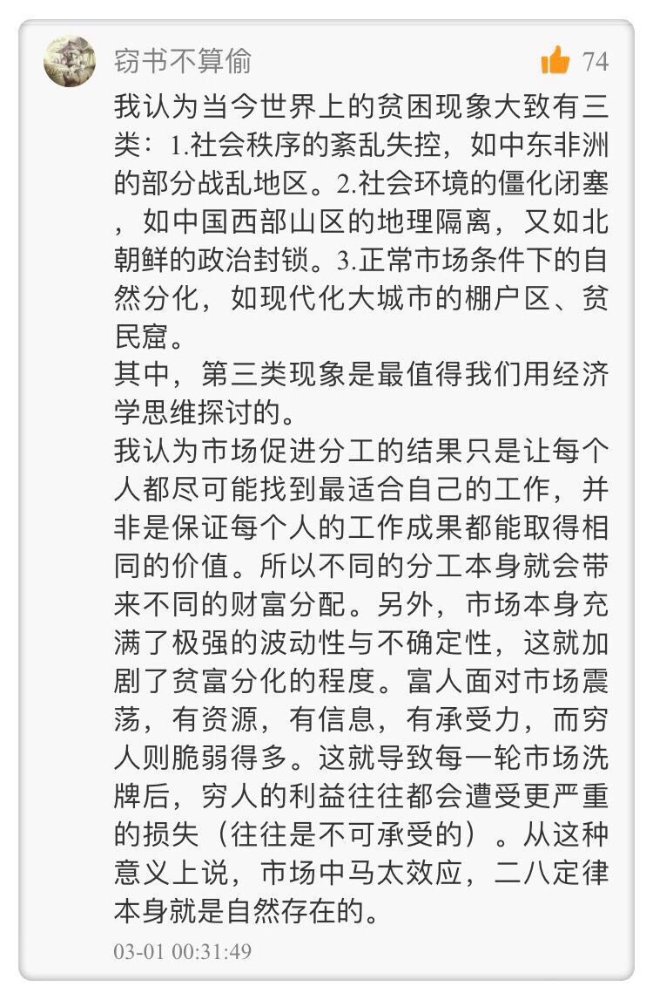

[TOC]

# 经济学的基础

## 是理性吗？

经济学关心的是存活条件。一个人，一个组织，甚至一个制度，能不能**存活**下来，和各种条件、情况的变化有关，而跟人是不是理性的没有关系。

## 是自私 or 爱心吗？

每一个人，不需要自己关心社会福利，他也不知道自己怎么去推动社会的福利。他只需要关心自己，追求他自己的福利就可以了。但是他在追求自己福利的过程中，会有一只看不见的手，让他的努力转变为对公共事业的推动。这只看不见的手，会让他的自私自利推动社会福利的改进。  -- 亚当·斯密

我们每天之所以能够吃上晚饭，不是因为面包师，不是因为屠夫，不是因为酿酒商，他们爱我们，他们的慈善，而是因为他们要自私自利，他们要追求他们的利益。每当我们跟他们做生意的时候，我们不说我们自己需要什么，而是说他们需要什么。  -- 亚当·斯密

人际互动二分法：小圈子靠爱心，大世界靠市场

人是自私的 —> 他有爱心 —> 爱心有限，爱心不能扩张 —> 于是我们需要一个陌生人互助的平台，那就是市场。

我们不会把陌生人跟陌生人打交道的规则，用到我们的小圈子里去，不会把市场的规则用到家庭、用到朋友圈里去。同样，我们也不会用家庭里面的要求和标准，去要求社会上其他的陌生人。

# 稀缺

经济学最基础的那块石头，不是理性人假设，也不是人性自私的假设，而是稀缺这个基本的事实。稀缺有两个原因，第一是你喜欢的东西别人也喜欢；第二是人的需求，其实是无限的。

有稀缺就得有选择，有选择就必须要有标准，选择的标准就是歧视。

凡歧视必要付出代价。竞争的压力，会迫使人们减少那些不恰当的歧视。

歧视行为的效率含义：让我们脱离黑板经济学，不能简单地把人理解为单独的人，没有文化背景的人；不能把人们做生意的环境，简单地理解为有或者没有法律保障。

在现实中，歧视往往都是有原因的，尤其在激烈竞争的市场经济下，歧视往往是有效率的。如果出于政治原因，政府逼着商业银行改变歧视标准的话，就有可能酿成恶果。

# 成本

一个资源，它有若干的选项，被选中的那个选项，它的成本是那些所有落选的选项当中，价值最高的那个。简单说，**成本就是放弃了的价值最高的代价**。选项是选项的成本，选项与选项互为成本。

成本是放弃了的最大代价，但不是你的东西就不算是放弃。比如现在转行打篮球、当演员，这不是一个真正的选项，这只是一个幻想而已。

## 你的成本由别人决定

1. 负面感受不是成本
2. 你的成本由别人决定
   - 成本是放弃了的价值最高的代价，这个代价是由别人决定的，所以你的成本由别人决定
3. 你的职业范围由社会决定
   - 你拥有你的生命，但是你的生命是怎么度过的，你的职业是怎么选择的，很大程度上是由社会其他人决定的。
   - 其实，我们年轻的时候花大量时间去学习不同的课程，参加不同的社会实践，目的就是要搞清楚，哪个职业能给自己带来最大收益，能最大满足自己的兴趣，同时自己所花费的成本是最低的。

## 别只盯着钱

1. 货币成本有别于**全部成本**
   - 货币成本：钱，全部成本：货币成本+时间+...
   - 每当我们做决定的时候，不应该只看着钱，而要看到所有的成本
2. 如果考虑到全部成本，
   - 对于付费课程，货币成本当然更高，但是比起那些免费的资源来说，你得到有价值信息的可能性就大得多，这时候你的总成本反而是下降的。
   - 虽然中间商赚差价，但是也让商品价格更便宜（你不用跑到地头和菜农讲菜价）；而且中间商之间也有竞争
   - 对国家而言，给士兵发薪比免费征兵更便宜

## 别只盯着沉没成本（什么是我们的行动指南？）

有选择就有成本，没有选择就没有成本。我们无法改变过去做过的选择，所以过去的选择以及带来的后果对我们而言就是沉没成本。当我们没办法再做选择的时候，就不存在成本（真正的成本永远向前看，沉没成本是向后看的）。所以，沉没成本不能作为我们的行动指南。

我们永远要盯住**边际成本和边际收益**，把它作为我们未来行动的指南。

这告诉我们通过考虑边际成本和边际收益在当下做好决策，如果收益率比较低就要“止损”（果断放弃），如果收益率比较高就要将就（继续投入）。

所以，

- 范进中举那样的做法，是不应该仿效的，他是有成本的。我们不能把一个人反复进行尝试的成本，当做只是一次的成本。他每做一次尝试，都会产生新的成本，每做任何一件事，他都有成本。过去我们总是说只要有一点点机会，我们就决不放弃，这样的想法是错的（干嘛不去做收益率更好的事呢？当然，这里不是只盯着货币成本）。

## 从成本角度理解盈利与亏损

经济学中把盈利和亏损都理解成意外

## 最终产品的供需决定原材料的成本

高中课本上讲过：价格围绕价值上下波动，最主要影响因素就是供求关系

一件物品的价格不是由成本决定的，而是由供求决定的

而且由供求关系决定的最终产品的价格会反过来影响原材料的成本

## 租

# 社会成本

只有懂了社会成本问题，你才会懂得社会和经济的基本运行规律。

## 伤害与被伤害

在社会中，有众多交互案例，一般看来都是一方在伤害另一方，都是一方需要对另一方做出赔偿，都需要限制加害于人的一方。

## 值得与不值得

所有的伤害都是相互的，不是一方伤害另一方，而是双方都在争夺稀缺的资源。在会产生互相伤害的事件中，**谁避免伤害的成本最低，谁就应该承担最大责任**，这样分摊责任，整个社会为避免意外所要付出的总成本就会达到最小。

## 谁用得好归谁

所有的伤害都是相互的，不是一方伤害另一方，而是双方都在争夺稀缺的资源。在会产生互相伤害的事件中，谁避免伤害的成本最低，谁就应该承担最大责任，这样分摊责任，整个社会为避免意外所要付出的总成本就会达到最小。

一项有价值的资源，不管从一开始它的产权谁属，最后这项资源都会流动到最善于利用它、能最大化利用其价值的人手里去。这是**科斯定律**的一个重要含义。而在制度设计中，我们应该尽量让这种资源的流动和分配更方便容易，从而提高各项经济资源的使用效率。

## 

# Tips:

企业家是资源配置的中间人，其实是个隐形的拍卖者。他在猜有没有消费者愿意为他的经营活动买单。如果猜对了，社会不需要奖励他，他已经得到奖励，那就是他赚的钱；如果猜错了，他也不需要承认错误，因为他已经亏损，亏损就是恰当的惩罚。（第13讲）

在道理没有被清楚地指出以前，各种各样的说法看上去都是言之成理的。只有你清晰地指出，哪个才是真正解决问题的角度的时候，大家才容易看清楚。真理不是昭然若揭的。（第4周解答）

我们在关键时刻有什么样的选择，我们后来的一些选择，就取决于这个关键时刻的选择。有时候我们称之为“宪法时刻（ *Constitutional moment* ）”，就是你定你的操作系统的那一刻。（第4周解答）

还有很多同学讨论到底应不应该辞职，到底应不应该换工作。我自己个人的经验是这样的，无论在什么样的岗位工作，你看看比你年长的那些事业有成的同事，你自己扪心自问，再工作二三十年，变成他们甘心不甘心，愿意不愿意，高兴不高兴？（第4周解答）

